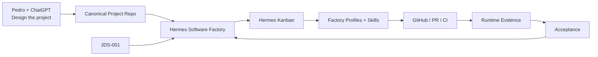

# Hermes Software Factory

> A reusable autonomous engineering organization built natively on Hermes/Jarvas.

**Status:** Architecture Review **v1.1 — ACCEPTED_WITH_CHANGES / PROPOSED FOR OWNER REVIEW**  
**No product/runtime implementation is authorized by this branch.**

## Vision

Hermes Software Factory (HSF) is a persistent engineering company inside the Hermes/Jarvas ecosystem. Pedro and ChatGPT design a project, persist approved decisions into canonical artifacts and hand the project to the Factory. HSF compiles that definition into semantic Work Packages, an isolated Hermes Kanban board, staffing, JDS-backed gates, traceability and evidence-derived acceptance.

The v1.1 review deliberately reduces Factory infrastructure: Hermes/Jarvas already provides the execution substrate. The Factory concentrates on engineering semantics, workforce governance, project compilation, traceability and acceptance.



## v1.1 architecture in one view

```text
Project repository          = product intent + implementation
.jarvas/engineering.yml     = JDS generic engineering/quality gates
Hermes Kanban               = operational work state
Hermes Profiles             = reusable employees
Factory Skill Registry      = approved professional procedures/competences
GitHub                      = SCM truth
Runtime evidence            = live truth
Jarvas Operations           = independent assurance/recovery
RITMO                       = scheduled/recurring initiation
Hermes MCP Bridge           = northbound ChatGPT/external-client boundary
Factory                     = compilation + staffing + traceability + governance + acceptance
ChatGPT                     = independent Factory Governor
Pedro                       = owner / strategic HITL
```

## Important v1.1 corrections

- **JDS-001 is the canonical generic quality/gate planner.** HSF consumes its Effective Gate Plan instead of building a second generic quality engine.
- **The MCP Bridge is northbound only.** Internal Factory execution uses supported native Hermes/Jarvas interfaces.
- **Factory Skills are Factory-owned.** Hermes provides the Skill mechanism; Factory controls the professional library, versions, evals and authorization.
- **Exact-SHA is deterministic.** `factory-exact-sha-auditor` is replaced by a machine validator/gate.
- **Generic Software Engineer.** `factory-python-engineer` is superseded by `factory-software-engineer`; language/framework expertise is normally supplied by approved Skills.
- **Platform Engineer added.** CI/CD, containers, IaC, deployment/service configuration and observability implementation receive a real engineering profession, separate from Jarvas Operations.
- **High-assurance Kanban starts fail-closed.** `auto_decompose=false` and `dispatch_approval_mode=structured` are the initial Factory baseline.
- **Hermes upstream updates are governed.** The hardened fork is reconciled through tests/exact-SHA/staging rather than blindly tracking upstream.
- **Factory UI extends Hermes Dashboard.** v1 does not justify another standalone web application.

## Canonical reading order

1. **[Executive Proposal](docs/00-executive-proposal.md)** — product/business case.
2. **[Architecture Review v1.1](docs/14-architecture-review-v1.1.md)** — accepted corrections against the original v1 proposal.
3. **[Canonical Design v1.1](docs/superpowers/specs/2026-08-18-hermes-software-factory-design-v1.1.md)** — current consolidated architecture.
4. **[ADR-0014 — Internal Native Execution Boundary](docs/adr/ADR-0014-internal-native-execution-boundary.md)**.
5. **[ADR-0015 — Factory-Owned Skills on Hermes Native Skill Model](docs/adr/ADR-0015-factory-owned-skills-on-hermes-native-model.md)**.
6. **[Agent Admission & Catalog Governance](docs/08-agent-admission-and-catalog-governance.md)**.
7. **[Agent DNA Runtime Configuration](docs/09-agent-dna-runtime-configuration.md)**.
8. **[Skills Architecture v1](docs/12-skills-architecture-v1.md)** and **[Skill Eval Plan](docs/13-skill-eval-plan-v1.md)** — historical v1 material still applicable where not superseded by v1.1.
9. **[Jarvas CLI Control-Plane Proposal](docs/15-jarvas-cli-control-plane-proposal.md)** — proposed local ecosystem/Factory client.
10. Original v1 documents (`01`–`07`, v1 spec, v1 agent catalog/Souls) remain design history; **v1.1 wins on conflict**.

## v1.1 executable design sources

```text
agents/
├── catalog-v1.1.yaml
├── _shared/
├── factory-software-engineer/
├── factory-platform-engineer/
└── factory-*/

gates/
└── exact-sha/gate.yaml

skills/
├── registry.yaml
├── registry-policy-v1.1.yaml
└── <category>/<skill>/SKILL.md

policies/
├── kanban-high-assurance-v1.1.yaml
└── hermes-upstream-reconciliation-v1.1.yaml
```

The source files are **design candidates**, not installed/runtime Profiles or active policies.

## v1.1 workforce

The base reusable catalog contains 17 active-candidate Profiles:

```text
factory-orchestrator
factory-workforce-architect
factory-requirements-engineer
factory-software-architect
factory-security-architect
factory-product-designer
factory-documentation-engineer
factory-tdd-red
factory-software-engineer
factory-platform-engineer
factory-code-reviewer
factory-security-reviewer
factory-fail-closed-inspector
factory-integration-tester
factory-evidence-auditor
factory-runtime-truth-observer
factory-release-manager
```

This is a company roster, not a permanently running swarm.

## Factory-native project contract v1.1

```text
.factory/
├── project.yaml
└── acceptance.yaml

.jarvas/
└── engineering.yml
```

Responsibilities:

```text
.factory/project.yaml     = Factory identity, canonical sources, board/workflow/autonomy
.factory/acceptance.yaml  = Factory acceptance classes and HITL/runtime rules
.jarvas/engineering.yml   = JDS-001 capabilities, criticality and generic engineering gates
```

## Target project handoff

```text
1. Design the project with Pedro + ChatGPT
2. Commit approved requirements/architecture/ADRs/Epics
3. Maintain .factory project/acceptance contract + .jarvas/engineering.yml
4. "Entrega à Factory"
5. Project Compiler reads canonical sources + JDS plan + ecosystem inventory
6. Factory reconciles Work Packages, Kanban and staffing
7. Hermes executes approved work continuously under policy
8. GitHub/CI/runtime evidence determines acceptance
9. True HITL/blockers are escalated
10. ChatGPT periodically audits/reopens through the northbound control surface
```

## Quality principle

The Factory never accepts `agent says done` as proof.

```text
approved intent
+
JDS/Factory required gates
+
independent review where required
+
exact candidate identity
+
runtime evidence where required
=
ACCEPTED
```

`NOT_RUN != PASS`; repository proof never silently becomes runtime proof.

## First pilot

`pestoura/hermes-security-labs` remains the first proposed client because it stresses architecture, ADRs, change governance, CI/exact-SHA, runtime evidence, HITL, trust and multi-repository dependencies.

It is not the Factory architecture. A second materially different project is required to prove portability.

## Current review gate

Review **Architecture v1.1** and the canonical v1.1 spec before implementation planning.

Only after owner acceptance should the repository move to:

```text
design/spec
-> implementation plan
-> TDD RED
-> minimal GREEN
-> hardening
-> CI/exact-SHA
-> merge
-> post-merge verification
```
