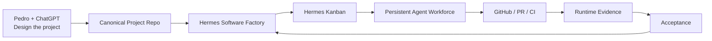
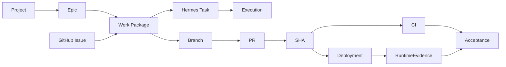

# Hermes Software Factory

> A reusable autonomous engineering organization built natively on Hermes Agent.

**Status:** Architecture & Operating Model v1 — **PROPOSED FOR REVIEW**  
**No product implementation is approved by this branch.**

## Vision

Hermes Software Factory (HSF) is not an automation for one repository. It is a persistent engineering company inside the Hermes/Jarvas ecosystem.

The owner and ChatGPT design a project, persist the approved decisions into canonical project artifacts and then hand the project to the Factory. HSF compiles that definition into an isolated Hermes Kanban board, a dependency graph, governed Work Packages, staffing and quality gates. Persistent specialized Hermes profiles execute the work; other profiles review it; GitHub/CI/runtime evidence proves it; ChatGPT performs independent periodic governance.



## Key idea

```text
Project repository = product intent + implementation
Hermes Kanban      = operational work state
Hermes profiles    = reusable employees
Hermes skills      = procedures/competences
GitHub              = SCM truth
Runtime evidence    = live truth
Factory             = compilation + staffing + quality + governance
ChatGPT             = independent Factory Governor
Pedro               = owner / strategic HITL
```

The Factory deliberately reuses Hermes native profiles, `SOUL.md`, skills, Kanban, dispatcher, review flows, worktrees, memory and scheduling rather than creating a competing runtime.

## Recommended reading order

1. **[Executive Proposal](docs/00-executive-proposal.md)** — the business/product case and the idea in one view.
2. **[Reference Architecture](docs/01-reference-architecture.md)** — system boundaries and technical components.
3. **[Operating Model](docs/02-operating-model.md)** — how projects flow from design to accepted delivery.
4. **[Agent Workforce & Agent DNA](docs/03-agent-workforce.md)** — the reusable engineering organization and workforce model.
5. **[Project Contract & Traceability](docs/04-project-contract-traceability.md)** — how Epics, Issues, WPs, Kanban tasks, PRs, SHAs, CI and runtime evidence stay connected.
6. **[Security, Quality & Governance](docs/05-security-quality-governance.md)** — fail-closed policy, evidence, segregation of duties and HITL.
7. **[Pilot & Roadmap](docs/06-pilot-and-roadmap.md)** — implementation phases and Hermes Security Labs as first pilot.
8. **[Proposed Foundational Decisions](docs/07-proposed-architecture-decisions.md)** — the decisions to accept/change/defer/reject before implementation.
9. **[Agent Admission & Catalog Governance](docs/08-agent-admission-and-catalog-governance.md)** — permanent Profile-vs-Skill gate and workforce lifecycle.
10. **[Agent DNA Runtime Configuration](docs/09-agent-dna-runtime-configuration.md)** — canonical `agent.yaml`, Hermes Profile Distribution projection, model/tool/MCP/memory policy.
11. **[Base Agent Catalog v1](docs/10-base-agent-catalog-v1.md)** — detailed configuration of the 17 bootstrap profiles.
12. **[Base Agent Souls v1](docs/11-base-agent-souls-v1.md)** — Factory Constitution plus the proposed professional Soul of every bootstrap profile.
13. **[Canonical Design Spec](docs/superpowers/specs/2026-08-18-hermes-software-factory-design.md)** — consolidated Architecture & Operating Model v1.

## Target project handoff

The target experience is intentionally simple:

```text
1. Design the project with Pedro + ChatGPT
2. Commit approved requirements/architecture/ADRs/Epics
3. Add/maintain .factory project contract
4. "Entrega à Factory"
5. Factory compiles/reconciles project
6. Hermes board and staffing are created
7. Work executes continuously under policy
8. Real HITL/blockers are escalated
9. Evidence determines acceptance
10. ChatGPT periodically audits/reopens as needed
```

## Factory-native project contract

A client repository is expected to expose a small machine-readable boundary:

```text
.factory/
├── project.yaml
├── quality.yaml
└── acceptance.yaml
```

The contract points to canonical project sources; it does not duplicate them and it does not contain the global Factory workforce.

## Traceability target



This lets the Factory answer both:

- **"Why does this PR exist?"** — trace backwards to Work Package, Epic, requirement and decision.
- **"What still blocks this Epic?"** — trace forwards to tasks, failed gates, HITL and runtime evidence.

## Quality principle

The Factory never accepts `agent says done` as proof.

```text
IMPLEMENTED
+
required tests
+
independent review
+
security gates where required
+
CI
+
exact-SHA coherence
+
runtime evidence where required
=
ACCEPTED
```

`NOT_RUN != PASS` and repository proof never silently becomes runtime proof.

## Workforce growth principle

The Factory workforce is intentionally extensible but not allowed to grow without discipline. Every proposed new profile passes the Agent Admission Gate and can be classified as:

```text
USE_EXISTING_PROFILE
ADD_SKILL_TO_EXISTING_PROFILE
ADD_RUNBOOK
ADD_TASK_TEMPLATE
CREATE_ROUTINE_PROFILE
CREATE_PROFESSIONAL_PROFILE
DEFER
REJECT
```

A missing capability may trigger a proposal; it never silently creates a new agent or new authority.

## First pilot

`pestoura/hermes-security-labs` is proposed as the first client because it already exercises ADRs, change records, CI/exact-SHA, runtime evidence, HITL, secrets/trust and multi-repository dependencies.

It is **not** the architecture of the Factory. The portability proof is a second materially different project onboarded without redesigning Factory core.

## Current review gate

Review Architecture & Operating Model v1 and classify the foundational decisions as:

```text
ACCEPTED
ACCEPTED_WITH_CHANGES
DEFERRED
REJECTED
```

Only after that review should this repository move to an implementation plan and the normal gated delivery lifecycle:

```text
design/spec
-> implementation plan
-> TDD RED
-> minimal GREEN
-> hardening
-> CI/exact-SHA
-> merge
-> post-merge verification
```
