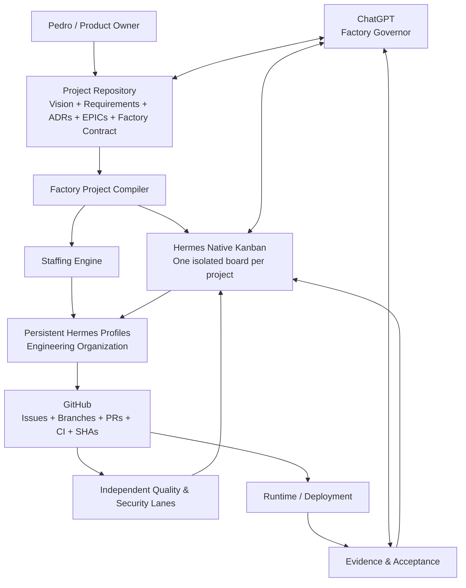
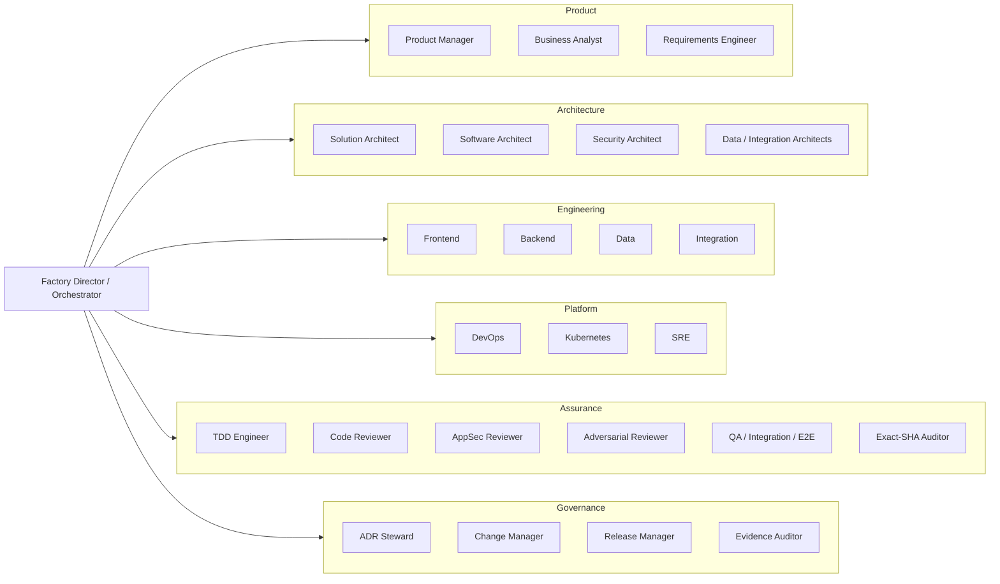
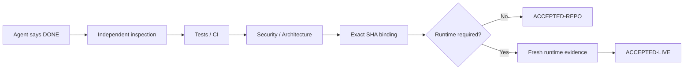
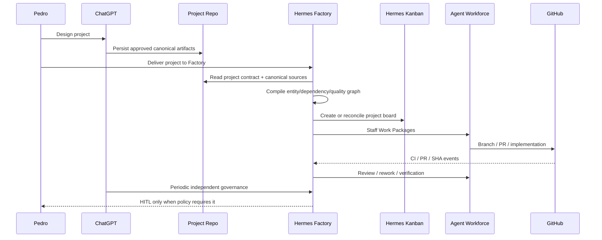

# Hermes Software Factory — Executive Proposal

**Status:** PROPOSED  
**Date:** 2026-08-18  
**Purpose:** formalize the product concept discussed by Pedro Estoura and ChatGPT before implementation.

## Executive summary

Hermes Software Factory (HSF) is proposed as a reusable, autonomous engineering organization built **on top of the native primitives already provided by Hermes Agent**.

The objective is not to automate one repository or one laboratory. The objective is to create a persistent software-engineering company that can receive a well-defined project, compile that definition into an executable delivery system, staff the work with specialized Hermes profiles, dispatch work through Hermes Kanban, verify quality independently, connect every artifact to GitHub and runtime evidence, and continue until the agreed acceptance state is reached or a real human gate is encountered.

A project should therefore move from:

```text
idea -> design with owner -> canonical project contract -> Factory onboarding
     -> project board -> work graph -> specialized agents -> engineering
     -> independent review -> evidence -> release/runtime validation -> acceptance
```

The Factory itself remains reusable. **Hermes Security Labs is only the first pilot.**

## The idea in one diagram



## Why Hermes is the right substrate

The Factory should not rebuild infrastructure Hermes already owns. Hermes Agent already provides the core mechanics required for durable multi-agent engineering:

- isolated profiles with their own `SOUL.md`, configuration, memory, sessions, skills and cron;
- native Kanban boards with durable task state and event history;
- assignment of profiles to tasks;
- task dependencies and promotion;
- dispatcher/worker execution;
- Git worktrees/workspaces for isolation;
- per-task skills and model overrides;
- review/rework flows;
- Goal Mode for iterative task completion;
- cron/scheduling;
- browser, terminal, filesystem, MCP and external integrations.

HSF therefore becomes an **enterprise/governance layer over Hermes**, not a competing agent runtime.

## What HSF adds

The Factory adds the organizational intelligence that a generic agent runtime deliberately does not own:

1. **Project Compiler** — reads the canonical project definition and creates/reconciles the operational delivery graph.
2. **Factory Project Contract** — a small declarative manifest in every client repository that tells HSF where truth lives and what delivery/quality policy applies.
3. **Enterprise Agent Catalog** — versioned persistent professions (architects, engineers, reviewers, SRE, security, QA, release, audit) built as Hermes profiles.
4. **Agent DNA** — versioned Soul, authority, methods, tools, skills, runbooks, gates, output contracts and evaluations.
5. **Staffing Engine** — composes a team dynamically from the work type, technology, risk and required assurance.
6. **Quality Engine** — Definition of Done, TDD, code review, security review, CI, exact-SHA, integration/runtime and evidence gates.
7. **Traceability Graph** — links Project -> Epic -> Work Package -> Kanban Task -> Issue -> Branch -> PR -> Commit -> CI -> Runtime Evidence -> Acceptance.
8. **Governance and HITL** — fail-closed policies for secrets, destructive operations, unresolved architecture, production promotion and explicit approvals.
9. **Portfolio View** — status across all projects, agents, blockers, releases, findings and quality metrics.
10. **Factory Control MCP** — a stable control surface through which ChatGPT can inspect, validate, reopen, pause, resume and govern the Factory without depending on private implementation details.

## The engineering organization



The organization is a **catalog**, not a fixed swarm. The Factory activates only the profiles needed for each Work Package.

## Separation of responsibilities

| Layer | Canonical responsibility |
|---|---|
| Project repository | product intent, architecture, requirements, ADRs, implementation and tests |
| Hermes Kanban | current operational work state |
| Hermes profiles | persistent workforce identities |
| Hermes skills | procedures and specialist capabilities |
| GitHub | SCM state: issues, branches, PRs, commits and CI |
| Runtime evidence | current deployed/live truth |
| Factory | compilation, staffing, policy, traceability, quality and portfolio governance |
| ChatGPT | independent Factory Governor / second-line technical acceptance |
| Pedro | owner decisions, strategic intent and mandatory HITL |

## Core quality principle

The Factory must never accept an agent's declaration of completion as proof.



`NOT_RUN` is never `PASS`. Repository evidence never proves runtime state. Evidence for SHA-A never proves SHA-B.

## Project handoff experience

The target owner workflow is intentionally simple:

1. Pedro and ChatGPT design the project together.
2. Decisions are committed into canonical project artifacts.
3. A `.factory/` contract declares truth locations and operating policy.
4. Pedro says: **"Entrega à Factory."**
5. HSF validates and compiles the project.
6. HSF creates/reconciles the isolated Hermes board.
7. Epics are decomposed into traceable Work Packages and tasks.
8. Required specialist profiles and skills are assigned.
9. The Factory runs continuously, escalating only real HITL/blockers.
10. ChatGPT performs periodic independent governance rounds and can reopen work when evidence does not satisfy the contract.

## Example: project onboarding



## Why this is strategically valuable

The value is not merely faster coding. It is the conversion of a personal agent ecosystem into a **repeatable engineering operating system**:

- projects become machine-operable without losing human design intent;
- the workforce is reusable across repositories and domains;
- expert behavior is versioned and regression-tested;
- work state is durable across sessions;
- quality is enforced structurally rather than requested conversationally;
- GitHub and runtime truth remain independently verifiable;
- the same organization can run multiple projects concurrently;
- supervision can be periodic because the Factory itself remains operational between reviews.

## Proposed product boundary

HSF should be a separate product/repository integrated with Hermes through supported primitives (profiles, skills, plugins/MCP, Kanban, CLI and runtime services). It should **not** embed project-specific agent Souls in client repositories and should avoid unnecessary changes to the Hermes core.

## First proof

Hermes Security Labs is proposed as the first end-to-end pilot because it already contains mature examples of:

- ADRs and change records;
- EPIC/work breakdown concepts;
- strict repository-vs-runtime evidence separation;
- CI and exact-SHA gates;
- security/human promotion gates;
- multi-repository dependencies such as Hermes Vault and Hermes MCP Bridge.

The pilot succeeds only if HSF remains reusable for the second unrelated project without redesigning its core.

## Decision requested

Review the proposal as a product architecture. If accepted, the next phase is **implementation planning**, not immediate ad-hoc profile creation.

The implementation should follow:

```text
design/spec
-> implementation plan
-> TDD RED
-> minimal GREEN
-> hardening
-> CI/exact-SHA
-> merge
-> post-merge verification
```
