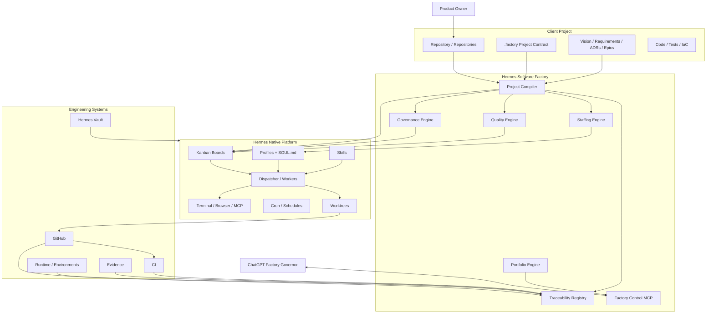
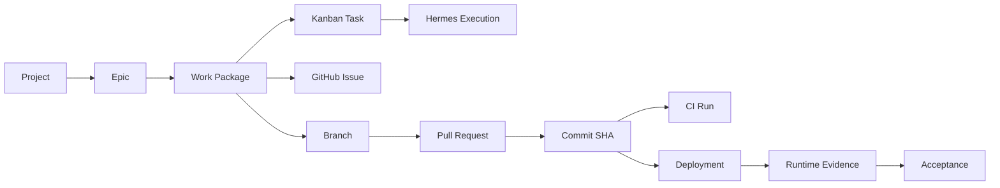
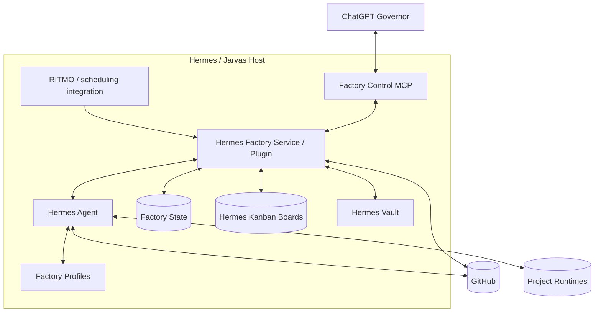
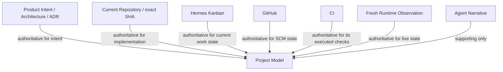

# Hermes Software Factory — Reference Architecture

**Status:** PROPOSED  
**Version:** v1 design

## Architectural goal

Hermes Software Factory (HSF) is a reusable engineering control layer built on top of Hermes Agent primitives. It must support multiple unrelated projects without project-specific logic leaking into the Factory core.

The Factory must preserve these boundaries:

- Hermes Agent remains the agent runtime and execution substrate.
- Hermes Kanban remains the durable operational work queue/state machine.
- Hermes profiles remain persistent worker identities.
- GitHub remains the source of truth for SCM objects.
- Client repositories remain the source of truth for project/product intent and implementation.
- Live/runtime claims require fresh runtime evidence.
- HSF adds project compilation, organizational policy, staffing, traceability, quality governance and portfolio control.

## Context diagram



## Logical components

### 1. Project Compiler

Converts project intent into an operational model.

Inputs:

- `.factory/project.yaml`;
- `.factory/quality.yaml`;
- `.factory/acceptance.yaml`;
- canonical architecture/requirements/roadmap/ADR locations;
- GitHub current state;
- current Hermes board state when reconciling an existing project.

Outputs:

- normalized Project Model;
- entity graph;
- Epic/Work Package graph;
- dependency DAG;
- quality/gate assignments;
- staffing requirements;
- idempotent Kanban reconciliation plan.

The compiler must be deterministic with respect to a frozen input revision where possible. It must not silently infer a conflicting architectural decision when an authoritative artifact exists.

### 2. Traceability Registry

Maintains durable relationships without replacing the systems that own each object.



Registry entries should carry stable external IDs, source system, repository/project identity, timestamps, provenance and current classification. Raw external content remains in the owning system.

### 3. Staffing Engine

Selects professions and specialist routines for each Work Package.

Inputs include:

- work type;
- technology stack;
- architecture domain;
- risk/assurance class;
- quality policy;
- project-specific constraints;
- current worker capacity.

Output is a staffing plan referencing versioned Factory profiles and required skills.

### 4. Quality Engine

Defines what `done` means for each class of work. It evaluates explicit gates, not prose claims.

Possible gates:

- specification completeness;
- architecture review;
- threat modeling;
- causal TDD RED;
- unit tests;
- integration tests;
- E2E tests;
- static analysis;
- dependency/supply-chain checks;
- security review;
- adversarial review;
- code review;
- CI;
- exact-SHA binding;
- documentation/change record;
- deployment;
- live/runtime validation;
- recovery/known-state proof;
- evidence acceptance.

### 5. Governance Engine

Applies autonomy and escalation policy.

Default Factory principle:

```text
GREEN / PASS / SUPPORTED / ACCEPTED
-> continue automatically
```

Stop/escalate only for:

- mandatory human approval;
- destructive or irreversible action;
- sensitive secret material handling;
- unresolved structural/architecture decision;
- material security/recovery risk;
- external blocker;
- policy conflict.

The engine should fail closed when policy state is invalid or unreadable for protected operations.

### 6. Portfolio Engine

Aggregates project-level operational state without becoming the source of truth for underlying evidence.

Example outputs:

- active projects;
- Epic completion;
- Work Packages by state;
- blocked/HITL work;
- active/idle agent capacity;
- rework rate;
- quality gate failures;
- security findings;
- releases/deployments;
- time-to-review / time-to-accept;
- evidence freshness.

### 7. Factory Control MCP

Stable external governance API for ChatGPT and other controllers.

Candidate capability groups:

```text
project: onboard / compile / reconcile / status / pause / resume
work: list / inspect / staff / dispatch / reopen
agents: catalog / version / health / eval status
quality: gate status / findings / acceptance readiness
traceability: explain relation / provenance chain
scm: reconcile GitHub / PR / SHA / CI
runtime: evidence status / freshness
portfolio: overview / blockers / releases
```

The MCP is a control surface. It should not leak secrets or become a second implementation runtime.

## Deployment model



The exact storage boundary between Factory state and Hermes Kanban state must be finalized during implementation design. HSF must not fork or directly depend on undocumented internal schemas where a supported interface can be used.

## Native-first extension strategy

Hermes itself advocates a narrow core and capability at the edges. HSF follows that principle:

1. reuse existing Hermes behavior;
2. add Factory skills and profile distributions;
3. use a plugin/service for cross-cutting Factory policy and orchestration;
4. expose a Factory MCP for stable external control;
5. change Hermes core only when a generic capability genuinely cannot be delivered at the edges.

## Isolation model

### Project isolation

Each client project receives a separate Hermes Kanban board and independent workspaces/logs as supported by Hermes.

### Work isolation

Engineering work that modifies Git should use isolated worktrees/branches wherever applicable.

### Agent isolation

Persistent professions are distinct Hermes profiles, allowing independent Soul, config, memory, skills and toolsets.

### Authority isolation

Implementers must not be the sole approvers of their own work. Review/acceptance roles are separate profiles or governance components.

## Source authority model



When sources conflict, the Factory must classify the conflict and refuse to manufacture a false coherent state.

## Non-goals for v1

- replace Hermes Kanban;
- replace GitHub Issues/PRs;
- create a generic SaaS multi-tenant product;
- support arbitrary non-Hermes agent runtimes;
- eliminate all human decisions;
- allow agents unrestricted credential access;
- infer live deployment state from repository state;
- build a new LLM orchestration engine when Hermes already provides one.
