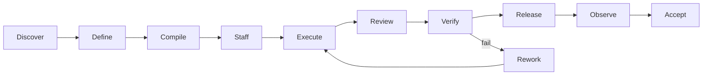
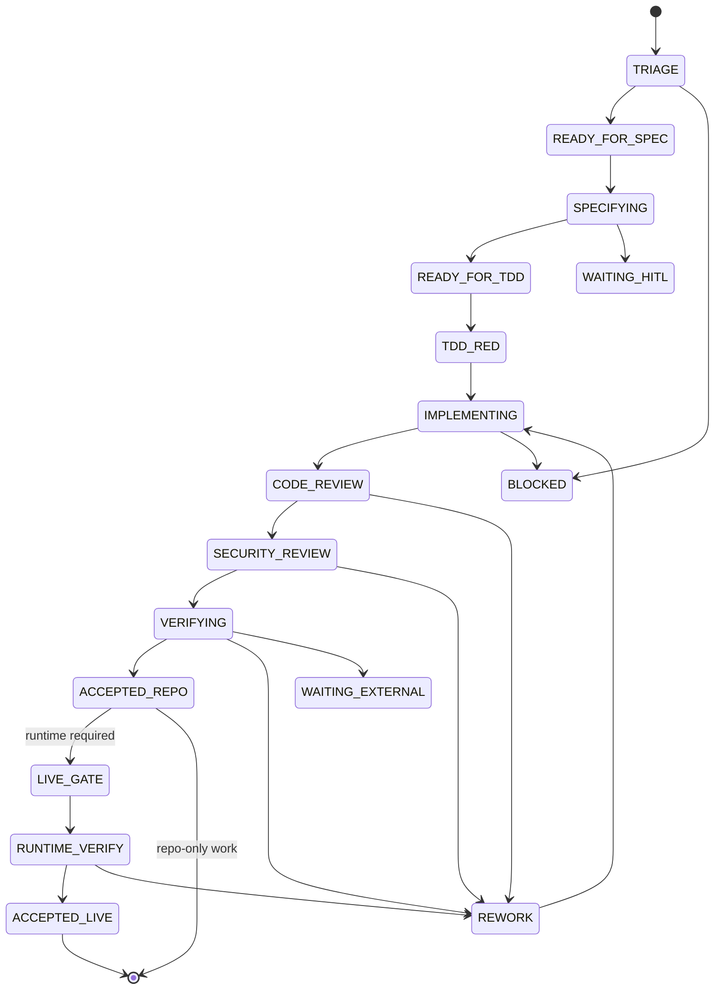
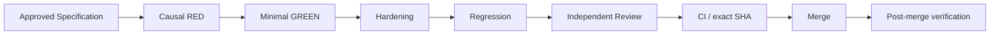
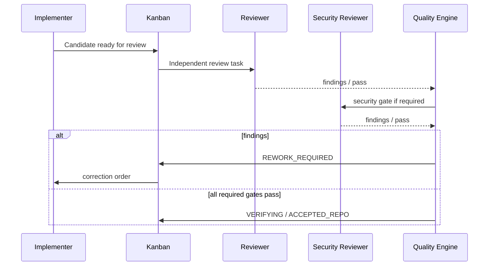
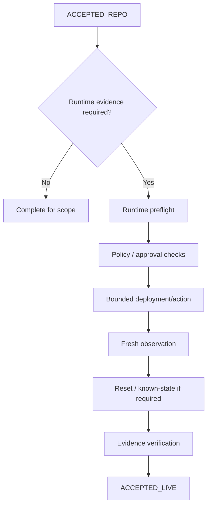

# Hermes Software Factory — Operating Model

**Status:** PROPOSED

## Purpose

This document defines how the Factory operates from project conception to accepted delivery. It separates human design intent, project compilation, autonomous execution, quality assurance, runtime validation and independent governance.

## Operating principle

HSF is not a single autonomous agent. It is a **governed organization of persistent specialist agents** coordinated through Hermes Kanban and Factory policy.



## Phase 0 — Project design with the owner

Pedro and ChatGPT collaboratively define:

- purpose and expected outcomes;
- product scope and non-goals;
- architecture and technology stack;
- trust boundaries and security constraints;
- repositories and ownership boundaries;
- requirements and acceptance criteria;
- ADRs and explicit decisions;
- Epics/milestones;
- deployment/runtime expectations;
- quality/assurance profile;
- autonomy and HITL policy.

Conversation is a design medium, not the final source of truth. Approved decisions are persisted into canonical project artifacts before Factory execution.

## Phase 1 — Factory handoff

Target owner command:

> **Entrega à Factory.**

The Factory performs a preflight:

1. resolve repository/repositories;
2. validate `.factory/` contract;
3. read declared canonical sources;
4. inspect existing GitHub objects;
5. detect previous Factory identity/board if present;
6. validate quality and autonomy profiles;
7. identify unresolved structural decisions;
8. produce a proposed compilation/reconciliation result.

No work is dispatched if a required structural decision is unresolved.

## Phase 2 — Project compilation

The compiler generates or reconciles:

```text
Project
  -> Milestones
    -> Epics
      -> Work Packages
        -> Kanban Tasks
          -> Gates
          -> Staffing
          -> Dependencies
```

Compilation must be idempotent. Re-running it against unchanged canonical input must not duplicate cards or GitHub objects.

## Phase 3 — Staffing

Every Work Package receives a team composition based on work characteristics.

Example:

```yaml
work_package:
  type: backend_authentication
  stack: [python, fastapi, oidc]
  risk: high

staffing:
  design:
    - factory-software-architect
    - factory-security-architect
  build:
    - factory-python-engineer
    - factory-iam-specialist
  assurance:
    - factory-tdd-red-engineer
    - factory-appsec-reviewer
    - factory-integration-tester
    - factory-exact-sha-auditor
```

Assurance profiles must be independent from the implementer where the gate intends independent validation.

## Phase 4 — Execution lifecycle

Recommended high-assurance state model:



Hermes native states may be mapped onto this richer Factory state model rather than changing upstream state semantics unnecessarily. The exact mapping is an implementation concern.

## Phase 5 — TDD pipeline

Default software-feature lifecycle:



### Causal RED rule

A RED result is valid only if it fails for the intended missing behavior. Import errors, broken fixtures, missing dependencies or unrelated failures do not satisfy the RED gate.

### Minimal GREEN rule

The implementation agent may not weaken or rewrite the frozen acceptance test merely to make it pass unless the specification itself is formally revised.

## Phase 6 — Review and rework

A reviewer does not share the implementer's success criterion. Its role is to find reasons the candidate should not be accepted.



A rework order must be bounded: exact findings, required correction, invariants that must remain unchanged and evidence required after correction.

## Phase 7 — GitHub lifecycle

For code-bearing work:

```text
Work Package
-> isolated worktree
-> branch
-> implementation commits
-> PR
-> independent review
-> CI
-> exact candidate SHA
-> merge
-> post-merge exact-SHA validation
```

No gate generated for a pre-change SHA survives automatically when the candidate changes. Gate freshness must be evaluated by policy.

## Phase 8 — Runtime lifecycle

Repository acceptance and live acceptance are different classes.



A runtime gate may require explicit human approval before a mutation. Sensitive secrets remain outside normal logs/evidence.

## Phase 9 — Acceptance

Possible explicit acceptance classes:

- `ACCEPTED-SPEC` — design/specification accepted;
- `ACCEPTED-REPO` — repository/CI proof accepted;
- `ACCEPTED-INTEGRATION` — cross-component integration accepted;
- `ACCEPTED-LIVE` — fresh runtime behavior accepted;
- `ACCEPTED-RELEASE` — release candidate accepted;
- `ACCEPTED-CAMPAIGN` — multi-stage campaign acceptance completed.

Avoid a generic ambiguous `DONE` when the evidence class matters.

## Autonomous continuation policy

The Factory should continue automatically when the next transition is covered by current policy and the required evidence is valid.

It must stop/escalate for:

- secret generation or direct secret material handling that requires operator participation;
- irreversible/destructive operations;
- explicit production/release gate;
- unresolved architecture/product decision;
- security/recovery risk outside the approved envelope;
- external blocker;
- failed policy/configuration validation.

## Continuous execution vs governance rounds

The Factory itself may run continuously through Hermes dispatch/scheduling. ChatGPT does **not** need to remain connected for the workforce to continue.

ChatGPT Factory Governor performs periodic rounds:

```text
rehydrate project truth
-> inspect board/executions
-> inspect GitHub/CI
-> inspect evidence/runtime freshness
-> challenge accepted work
-> reopen invalid acceptance
-> resolve next governance action
-> persist checkpoint/report
```

A governance round is second-line validation, not the Factory's worker loop.

## Concurrency model

Concurrency is controlled, not maximized.

Principles:

- parallelize independent Work Packages;
- use worktrees for Git-changing work;
- lock shared resources;
- avoid multiple workers changing the same boundary simultaneously;
- enforce per-profile and per-project capacity;
- do not dispatch duplicate active work;
- preserve idempotency keys across retries.

## Failure/recovery

Failure is a first-class state.

```text
failure
-> classify
   -> transient: retry within bounded policy
   -> implementation defect: REWORK
   -> external blocker: WAITING_EXTERNAL
   -> policy/HITL: WAITING_HITL
   -> unsafe/ambiguous: RECOVERY
```

A failed or interrupted mutation must not be treated as complete because the initiating agent disconnected.

## Reporting

Routine project status should derive from operational sources, not narrative summaries.

Recommended project summary:

```text
Project status
- active milestone / Epic
- WPs by state
- blockers / HITL
- active workers
- PRs under review
- failed gates
- security findings
- latest accepted SHA/release
- runtime evidence freshness
- next safe action
```
