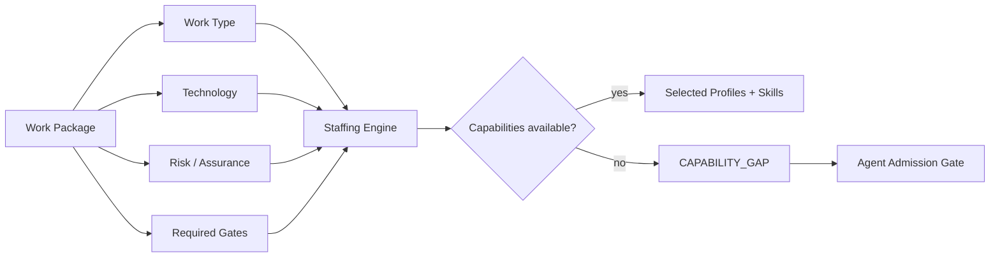
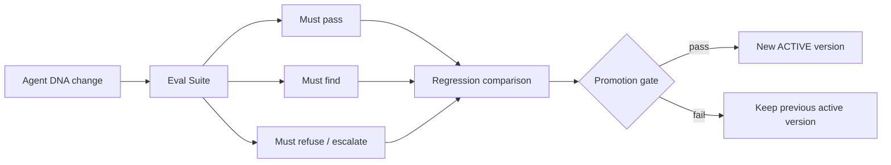

# Hermes Software Factory — Agent Workforce & Agent DNA

**Status:** PROPOSED

## Principle

Factory agents are not disposable prompts. They are **persistent Hermes profiles** representing stable professional roles inside the engineering organization.

A profile answers **who the worker is**. Skills and runbooks answer **how the worker performs a technique**. A Kanban task answers **what the worker must do now**.

```text
SOUL / Profile  = professional identity
Skill           = reusable competence / SOP
Project context = project-specific operating context
Task            = current bounded assignment
```

## Canonical Agent DNA

The Factory owns one canonical machine-readable definition for every role:

```text
agents/<agent-id>/
├── agent.yaml                 # canonical Factory Agent DNA
├── SOUL.md                    # compiled/native Hermes identity
├── distribution.yaml         # Hermes Profile Distribution manifest
├── config.yaml               # Hermes-native runtime config
├── mcp.json                   # Hermes-native MCP connections
├── skills/
├── cron/
├── evals/
└── README.md
```

`agent.yaml` carries the organizational semantics that Hermes itself does not need to own: mission, routing capabilities, authority, independence rules, model class, memory policy, tool/MCP policy, gates, output contracts and eval requirements.

The Agent Compiler will render the Hermes-native distribution from the approved Agent DNA. See `09-agent-dna-runtime-configuration.md`.

## Agent DNA dimensions

| Dimension | Purpose |
|---|---|
| identity | stable professional mission and posture |
| routing | how Project Compiler/Orchestrator recognize suitable work |
| responsibilities | what the agent owns |
| non-responsibilities | explicit boundaries |
| authority | allowed mutations/decisions |
| independence | incompatible producer/reviewer roles |
| model policy | capability class, not hard-coded vendor |
| memory policy | what may persist and with what authority |
| tool/MCP policy | least-privilege runtime exposure |
| methods/skills | standard way of working |
| invariants | conditions never to violate |
| output contract | structured handoff expectations |
| escalation | what requires another role/HITL |
| evals | regression tests for Agent DNA behavior |

## Factory Constitution + Role Soul

All profiles inherit a common Factory Constitution covering source-of-truth, evidence, scope, secrets, safety, handoff and integrity. Each profile then adds its role-specific Soul.

```text
Factory Constitution
+
Role Soul
+
Agent version identity
=
compiled SOUL.md
```

This prevents 17 copies of core governance language from drifting independently. Full proposed Souls are in `11-base-agent-souls-v1.md`.

## Professions vs routine stations

The Factory uses two types of persistent specialization.

### Professional profiles

Require broad domain judgment and stable professional identity, for example:

- Requirements Engineer;
- Software Architect;
- Security Architect;
- Product Designer;
- Documentation Engineer;
- Python Engineer;
- Code Reviewer;
- Security Reviewer;
- Integration Tester;
- Evidence Auditor;
- Release Manager;
- Workforce Architect.

### Routine profiles

Narrow, repeatable controls where independence and strict output are valuable, for example:

- Causal-RED Builder;
- Fail-Closed Inspector;
- Exact-SHA Auditor;
- Runtime Truth Observer.

A routine does not become a profile merely because it is repeatable. It still passes the Agent Admission Gate; many routines remain Skills or Runbooks.

## Organizational map

```mermaid
flowchart TB
    FD[Factory Orchestrator]

    FD --> PROD[Product & Requirements]
    FD --> UX[Product Design / UX]
    FD --> ARCH[Architecture]
    FD --> ENG[Engineering]
    FD --> PLAT[Platform & SRE]
    FD --> QA[Quality Engineering]
    FD --> SEC[Security Engineering]
    FD --> DOC[Documentation & Developer Experience]
    FD --> GOV[Governance & Release]
    FD --> WORK[Workforce Engineering]

    PROD --> REQ[Requirements Engineer]
    UX --> PD[Product Designer]

    ARCH --> SW[Software Architect]
    ARCH --> SARCH[Security Architect]

    ENG --> PY[Python Engineer]
    ENG --> FUTURE[Conditional language/domain engineers]

    PLAT --> PS[Conditional DevOps / K8s / SRE profiles]

    QA --> TDD[TDD RED]
    QA --> CR[Code Reviewer]
    QA --> INT[Integration Tester]

    SEC --> SR[Security Reviewer]
    SEC --> FC[Fail-Closed Inspector]

    DOC --> DE[Documentation Engineer]

    GOV --> SHA[Exact-SHA Auditor]
    GOV --> EVA[Evidence Auditor]
    GOV --> RT[Runtime Truth Observer]
    GOV --> REL[Release Manager]

    WORK --> WA[Workforce Architect]
```



The diagram shows the **bootstrap workforce**, not every eventual profession. Additional domain agents enter through the permanent Agent Admission Gate.

## Orchestrator role

The Factory Orchestrator is a coordinator, not an implementation super-agent.

It may:

- inspect compiled project/board state;
- decompose bounded approved work;
- create/link tasks;
- assign approved profiles;
- attach skills;
- inspect worker status;
- request review/rework;
- identify blockers;
- coordinate dependencies.

It should **not** write production code or independently approve work it coordinated.

## Staffing engine

Staffing is computed from work characteristics.



A capability gap never silently creates a new profile.

## Bootstrap catalog v1

```text
factory-orchestrator
factory-workforce-architect
factory-requirements-engineer
factory-software-architect
factory-security-architect
factory-product-designer
factory-documentation-engineer
factory-tdd-red
factory-python-engineer
factory-code-reviewer
factory-security-reviewer
factory-fail-closed-inspector
factory-integration-tester
factory-exact-sha-auditor
factory-evidence-auditor
factory-runtime-truth-observer
factory-release-manager
```

Detailed configuration for all 17 roles is defined in `10-base-agent-catalog-v1.md`.

## Tool policy

Tool availability follows role necessity and least authority.

Examples:

- Orchestrator: Kanban/Factory/GitHub coordination; no product implementation by default.
- Implementer: scoped repository/worktree + tests + approved engineering tools.
- Code/Security Reviewer: repository/PR read + review/comment/request changes; no implementation mutation.
- Runtime Observer: runtime observation only; no deployment/configuration mutation.
- Evidence/Exact-SHA Auditor: SCM/CI/evidence read only.
- Release Manager: controlled promotion tools behind policy/HITL.

Hermes Profile isolation alone is not a filesystem sandbox. Runtime controls must be applied through config, tool exposure, MCPs, credentials, workspaces/backends and Factory policy.

## Project context

Project-specific instructions do not mutate global Souls.

A worker combines:

```text
Factory Agent DNA
        +
Factory Constitution / Role Soul
        +
project AGENTS.md / .hermes.md
        +
Factory Project Contract
        +
current Work Package / task
        =
execution context
```

## Model policy

Roles select logical model classes such as:

```text
reasoning-high
reasoning-standard
coding-high
coding-standard
fast-verifier
vision-capable
long-context
```

The Factory/Jarvas model policy resolves these classes to approved installed models. Professional identity must not be coupled to a vendor/model name unnecessarily.

## Agent versioning

An execution should be attributable to immutable Agent DNA:

```yaml
agent_identity:
  id: factory-security-reviewer
  version: 1.0.0
  agent_digest: sha256:...
  soul_digest: sha256:...
  runtime_config_digest: sha256:...
  skills:
    secure-code-review: 1.0.0
```

## Agent CI / evaluations

Agent changes require testing before promotion.



Minimum classes:

```text
must-pass
must-find
must-refuse
must-escalate
no-unapproved-mutation
source-authority
output-contract
regression
```

## Independence matrix

| Producer/action | Independent gate/role |
|---|---|
| implementation engineer | code reviewer |
| implementation engineer | security reviewer where required |
| deployment/release executor | runtime truth observer where independence is required |
| test author | high-assurance verifier when policy requires independence |
| orchestrator | final technical acceptance |
| workforce architect | approval of its own authority-increasing Agent DNA proposal |

## Memory policy

Agent memory accelerates orientation but never becomes an untracked authority source.

```text
canonical decisions remain in project artifacts
raw SCM state remains in GitHub
operational work state remains in Hermes Kanban
live truth requires runtime evidence
secrets do not belong in general memory
```

Profiles use one of three memory classes: `minimal`, `professional`, `professional+project`.

## Capacity model

```text
catalog          = the reusable company
active profiles  = current staffed team
skills           = techniques attached as required
subagents        = temporary assistance where useful
```

The goal is controlled concurrency and specialization, not maximum swarm size.

## Related design documents

- `08-agent-admission-and-catalog-governance.md`
- `09-agent-dna-runtime-configuration.md`
- `10-base-agent-catalog-v1.md`
- `11-base-agent-souls-v1.md`
