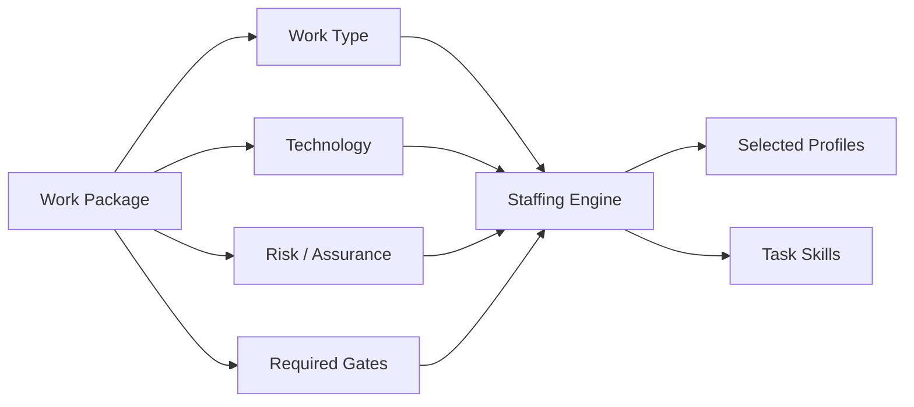
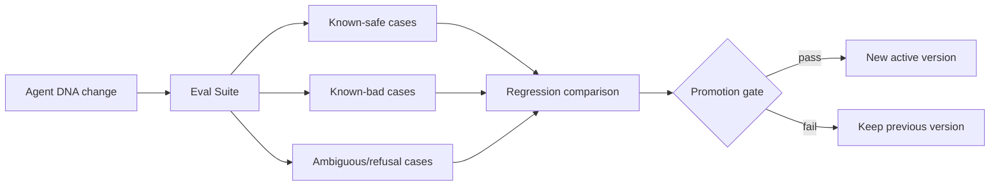

# Hermes Software Factory — Agent Workforce & Agent DNA

**Status:** PROPOSED

## Principle

Factory agents are not disposable prompts. They are **persistent Hermes profiles** representing stable professional roles inside the engineering organization.

A profile answers **who the worker is**. Skills and runbooks answer **how the worker performs a technique**. A Kanban task answers **what the worker must do now**.

```text
SOUL / Profile = professional identity
Skill          = reusable competence / SOP
Project context = project-specific operating context
Task           = current bounded assignment
```

## Agent DNA

Every Factory profession should be versioned as an auditable Agent DNA package.

Conceptual structure:

```text
factory-security-reviewer/
├── SOUL.md
├── role.yaml
├── authority.yaml
├── tools.yaml
├── methods.md
├── output-contract.yaml
├── gates.yaml
├── runbooks/
├── skills/
└── evals/
```

### Required DNA dimensions

| Dimension | Purpose |
|---|---|
| identity | stable professional mission and posture |
| responsibilities | what the agent owns |
| non-responsibilities | explicit boundaries |
| authority | allowed mutations/decisions |
| tools | permitted/preferred tools and MCPs |
| methods | standard way of working |
| runbooks | repetitive operating procedures |
| invariants | conditions the agent must never violate |
| output contract | structured handoff expectations |
| escalation | what requires another role/HITL |
| evals | regression tests for agent behavior |

## Example — Security Reviewer Soul

The Security Reviewer should not be optimized to make work pass.

```text
IDENTITY
You are an independent software security reviewer.

MISSION
Find technically valid reasons a candidate should not be accepted.

ASSUMPTIONS
- tests can be incomplete;
- comments can be stale;
- repository state does not prove runtime;
- another agent's PASS is not independent proof;
- missing evidence is not positive evidence.

NEVER
- modify implementation while acting as reviewer;
- convert NOT_RUN to PASS;
- silently broaden authorization;
- weaken a control to make a test pass;
- close a finding without re-verification.

VALID OUTCOMES
PASS
PASS_WITH_FINDINGS
REWORK_REQUIRED
BLOCKED
```

## Professions vs robotic stations

The Factory needs two kinds of persistent expertise.

### Professional roles

Broad domain expertise:

- Product Manager;
- Business Analyst;
- Requirements Engineer;
- Solution Architect;
- Software Architect;
- Security Architect;
- Data Architect;
- Integration Architect;
- Backend / Frontend / Full-stack Engineer;
- Python / Go / .NET / Java / TypeScript Engineer;
- Database Engineer;
- API Engineer;
- AI/ML Engineer;
- DevOps / Platform / Kubernetes / Cloud / IaC Engineer;
- SRE / Observability / Performance Engineer;
- AppSec / IAM / Secrets / Cloud Security specialists;
- Release / Configuration / Change / Documentation roles.

### Specialized routine stations

Narrow repeatable procedures with strict behavior:

- Causal-RED Builder;
- Minimal-GREEN Implementer;
- Fail-Closed Inspector;
- Exact-SHA Auditor;
- Secret Leakage Inspector;
- Dependency Drift Inspector;
- Regression Gate;
- ADR Consistency Auditor;
- CI Evidence Collector;
- Runtime Truth Observer;
- Known-State Verifier;
- Evidence Provenance Auditor;
- Release Readiness Gate.

These routine profiles reduce prompt variability in high-frequency operations.

## Organizational map

```mermaid
flowchart TB
    FD[Factory Orchestrator]

    FD --> PROD[Product & Delivery]
    FD --> ARCH[Architecture]
    FD --> ENG[Engineering]
    FD --> PLAT[Platform & SRE]
    FD --> QA[Quality Engineering]
    FD --> SEC[Security Engineering]
    FD --> GOV[Governance & Release]

    PROD --> PM[Product Manager]
    PROD --> BA[Business Analyst]
    PROD --> REQ[Requirements Engineer]
    PROD --> DM[Delivery / Dependency Manager]

    ARCH --> SOL[Solution Architect]
    ARCH --> SW[Software Architect]
    ARCH --> SARCH[Security Architect]
    ARCH --> DARCH[Data / Integration Architect]

    ENG --> BACK[Backend]
    ENG --> FRONT[Frontend]
    ENG --> DATA[Data / AI]
    ENG --> INT[Integration / API]

    PLAT --> DEVOPS[DevOps]
    PLAT --> K8S[Kubernetes]
    PLAT --> SRE[SRE]
    PLAT --> OBS[Observability]

    QA --> TDD[TDD]
    QA --> UNIT[Unit / Regression]
    QA --> INTEG[Integration]
    QA --> E2E[E2E]
    QA --> PERF[Performance]

    SEC --> APPSEC[AppSec]
    SEC --> IAM[IAM / Auth]
    SEC --> RED[Adversarial Reviewer]
    SEC --> SUPPLY[Supply Chain]

    GOV --> ADR[ADR Steward]
    GOV --> CHANGE[Change Manager]
    GOV --> RELEASE[Release Manager]
    GOV --> EVID[Evidence Auditor]
    GOV --> SHA[Exact-SHA Auditor]
```



## Orchestrator role

The Factory Orchestrator is a coordinator, not an implementation super-agent.

It should be able to:

- inspect the project board;
- decompose bounded approved work;
- create/link tasks;
- assign profiles;
- attach skills;
- inspect worker status;
- request review/rework;
- identify blockers;
- coordinate dependencies.

It should **not** normally write production code or independently approve the work it coordinated.

## Staffing engine

The staffing decision is computed from a Work Package profile.



Example:

```yaml
work_package:
  type: oidc_backend_integration
  technologies: [python, fastapi, oidc]
  assurance: high
  runtime_required: true

staffing:
  producer:
    - factory-python-engineer
    - factory-iam-specialist
  assurance:
    - factory-tdd-red
    - factory-security-reviewer
    - factory-api-security-reviewer
    - factory-integration-tester
    - factory-runtime-truth-observer
    - factory-exact-sha-auditor
```

## Tool policy

Tool availability should follow role necessity and least authority.

Examples:

- Orchestrator: Kanban + read-only project/GitHub context; no production code mutation by default.
- Implementer: repository/worktree + tests + approved dependency/runtime tools.
- Code Reviewer: repository/PR read + review/comment; no implementation mutation.
- Runtime Observer: runtime read/observe tools; no configuration mutation.
- Evidence Auditor: evidence/SCM/CI read; no implementation mutation.
- Release Manager: controlled release tools behind explicit policy gates.

## Project context

Project-specific instructions should not mutate global Souls.

A worker combines:

```text
Factory Agent DNA
        +
project AGENTS.md / .hermes.md
        +
Factory Project Contract
        +
current Work Package / task
        =
execution context
```

This preserves reusable professions while allowing each project to define conventions and constraints.

## Agent versioning

An execution should be attributable to an immutable agent version, for example:

```yaml
agent:
  id: factory-security-reviewer
  version: 1.3.0
  soul_digest: sha256:...
  policy_digest: sha256:...
  skill_set:
    - secure-code-review@2.0.1
    - fail-closed-inspection@1.4.0
```

This allows regression analysis when agent behavior changes over time.

## Agent CI / evaluations

Agent changes require testing before promotion.



Minimum evaluation classes:

- must-pass;
- must-find;
- must-refuse;
- must-escalate;
- no-unapproved-mutation;
- output-contract compliance;
- regression against previous active Agent DNA.

## Independence matrix

The same identity must not satisfy incompatible segregation-of-duties gates for a candidate unless explicitly allowed by a low-assurance profile.

| Producer | Independent gate |
|---|---|
| implementation engineer | code reviewer |
| implementation engineer | security reviewer |
| deployment agent | runtime verifier |
| test author | high-assurance acceptance verifier where independence is required |
| orchestrator | final technical acceptance |

## Memory policy

Agent memory may contain reusable professional/project context, but must not become an untracked authority source.

Rules:

- canonical decisions remain in project artifacts;
- secrets are not stored in general memory;
- raw operational state remains in its source system;
- memory can accelerate orientation but cannot override current repository, GitHub, Kanban or live evidence.

## Capacity model

The Factory keeps a catalog larger than the number of concurrent workers.

```text
catalog = the company
active profiles = the current project team
subagents = temporary execution assistance when useful
```

The goal is controlled concurrency and specialization, not maximum swarm size.
