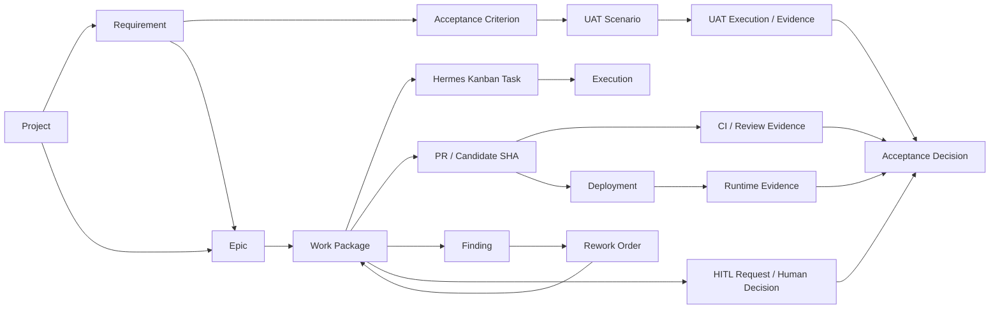

# Hermes Software Factory — Project Contract & Traceability

**Status:** RECONCILED FOR v1.2  
**Implementation authority:** NOT GRANTED

## Objective

A project must be transferable from approved human design into autonomous Factory operation without relying on conversation memory and without turning the Kanban into a lossy copy of product, SCM or runtime truth.

## Current project contract

The recommended v1.2 contract is:

```text
.factory/
├── project.yaml
└── acceptance.yaml

.jarvas/
└── engineering.yml
```

Responsibilities:

```text
.factory/project.yaml
  = Factory/project identity, repositories, canonical sources, workflow/board and autonomy boundaries

.factory/acceptance.yaml
  = acceptance classes, UAT/HITL/runtime acceptance semantics

.jarvas/engineering.yml
  = JDS-001 capabilities, risk/criticality and generic engineering gates
```

`.factory/quality.yaml` was part of the original v1 proposal and is **SUPERSEDED** for generic engineering gate selection. JDS-001 is authoritative for that concern. Any future Factory-specific quality overlay may contain only semantics not already represented by JDS and must not weaken mandatory JDS controls.

## Project Compiler inputs

The compiler reads:

- Factory contract;
- canonical requirements, ADRs, architecture, Epics and change records;
- JDS Effective Gate Plan;
- current code/tests/CI state;
- GitHub issues/PRs/SHAs;
- Hermes Kanban state;
- Hermes ecosystem capability inventory;
- runtime/evidence sources when relevant.

It reconciles a semantic project model and idempotent Work Packages rather than duplicating every source artifact into Kanban cards.

## Entity model v1.2

| Entity | Canonical owner | Purpose |
|---|---|---|
| Project | project repo / Factory contract | product identity |
| Requirement | project repo | required behavior |
| AcceptanceCriterion | project repo / approved acceptance baseline | observable acceptance intent |
| UATScenario | project acceptance source | versioned user-acceptance procedure |
| ADR | project repo | architectural decision |
| Epic | project repo / planning model | large capability/outcome |
| ChangeRecord | project repo | governed change |
| Issue | GitHub | collaboration/problem object |
| WorkPackage | Factory | bounded governed delivery unit |
| KanbanTask | Hermes | operational execution state |
| Execution | Hermes | actual Profile worker run |
| Branch / PR / CommitSHA | Git/GitHub | SCM isolation/candidate identity |
| CIRun | CI/GitHub | executed engineering evidence |
| Deployment | deployer/runtime | promoted candidate identity |
| RuntimeEvidence | runtime/evidence source | observed live truth |
| UATExecution / UATEvidence | Factory/project acceptance | acceptance execution proof |
| Finding | Factory | material failure/adverse observation |
| ReworkOrder | Factory | bounded corrective delivery unit |
| HITLRequest / HumanDecision | Factory governance | explicit human authority/evidence |
| AcceptanceDecision | Factory | governed decision over current evidence |

## Traceability graph



The graph must support traversal in both directions, for example:

- PR -> Work Package -> Epic/Requirement/ADR;
- Acceptance -> exact candidate, CI/reviews, UAT and runtime evidence;
- Finding -> original evidence -> rework -> corrected candidate -> reverification;
- HumanDecision -> request/version/context -> affected Work Package/stage.

## Work Package v1.2

Conceptual shape:

```yaml
id: HSF-WP-0123
project: example-project
epic: EPIC-042
objective: implement the bounded approved capability
sources:
  requirements: [REQ-17]
  decisions: [ADR-0007]
acceptance_criteria: [AC-01, AC-02]
engineering_plan: jds-effective-plan-ref
staffing:
  producer: factory-software-engineer
  reviewers: [factory-code-reviewer]
skills:
  required: [factory-reading-project-truth, factory-implementing-minimal-green]
trace:
  kanban_task: null
  branch: null
  pull_request: null
  candidate_sha: null
  ci_runs: []
  uat_executions: []
  findings: []
  human_decisions: []
  runtime_evidence: []
state: READY
```

The concrete staffing/Skills are produced from current Agent/Skill admission sources, not hard-coded by this example.

## Continuous handoff

A stage may promote the next stage only after the atomic handoff record has committed:

```text
stage outcome
+ artifact refs
+ evidence refs/freshness
+ candidate identity where applicable
+ Finding state
+ required independence state
+ next-stage prerequisites
```

`agent says done` is never a handoff proof.

## UAT and corrective action

Canonical chain:

```text
Requirement
-> AcceptanceCriterion
-> UATScenario
-> UATExecution
-> UATEvidence
-> AcceptanceDecision
```

A failing gate/UAT/review opens or updates a Finding. Corrective work follows:

```text
Finding
-> classification/root cause
-> bounded ReworkOrder
-> correction
-> targeted verification/regression
-> rerun invalidated gates/UAT
-> refreshed evidence
```

Frozen UAT/Acceptance Criteria cannot be edited by an implementer merely to obtain PASS; changes require an explicit Finding and authorized rebaseline.

## HITL traceability

Human decisions are first-class governance evidence. A decision is valid only for its `request_id`, `request_version` and matching context/candidate revision. Stale, expired or cancelled responses cannot unlock work.

## Idempotency and identity

Compiler-created entities require stable identity derived from canonical project/source identity. Recompilation of unchanged canonical input must not create duplicate Work Packages or Kanban tasks.

## Truth boundaries

```text
project/repository truth != Kanban execution state
PR/CI truth             != runtime truth
RITMO/external schedule != proof Factory work ran
worker narrative        != acceptance evidence
```

`NOT_RUN != PASS` throughout the graph.
