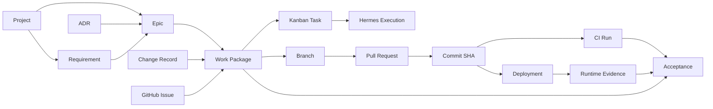
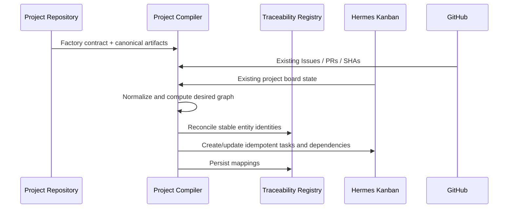
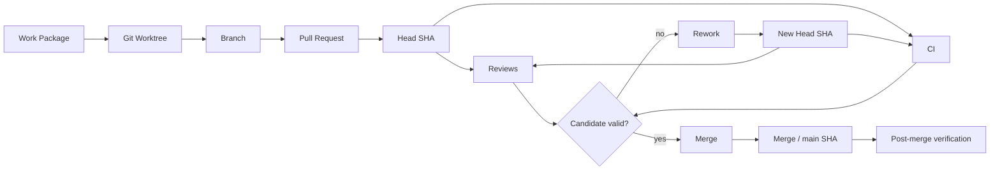
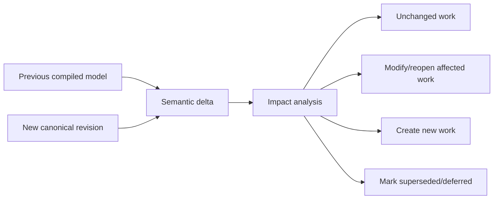

# Hermes Software Factory — Project Contract & Traceability

**Status:** PROPOSED

## Objective

A project must be transferable from human design into autonomous Factory operation **without relying on conversation memory** and without duplicating every artifact into the Kanban.

The solution is a small declarative Factory contract plus a traceability graph.

## Project contract

Each client project contains a `.factory/` directory owned by that project.

Recommended v1 layout:

```text
.factory/
├── project.yaml
├── quality.yaml
└── acceptance.yaml
```

The contract does not contain the global Factory workforce. It tells the Factory:

- what the project is;
- which repositories belong to it;
- where canonical sources live;
- what workflow/quality profile applies;
- what runtime environments matter;
- what autonomy/HITL rules apply;
- how existing IDs should be reconciled.

## Example `project.yaml`

```yaml
schema: hermes.factory/project/v1

project:
  id: hermes-security-labs
  name: Hermes Security Labs
  lifecycle: active

repositories:
  - id: labs
    repo: pestoura/hermes-security-labs
    role: product

  - id: vault
    repo: pestoura/hermes-vault
    role: platform_dependency

sources:
  vision:
    - README.md
  architecture:
    - docs/architecture/
  roadmap:
    - docs/roadmap/
  decisions:
    - docs/adr/
  changes:
    - changes/
  validation:
    - validation/

factory:
  board: hermes-security-labs
  workflow: high-assurance-engineering
  quality_profile: factory-high-assurance
  autonomy_profile: controlled-continuous
```

## Example `quality.yaml`

```yaml
schema: hermes.factory/quality/v1

required_gates:
  specification: true
  tdd_red: true
  unit: true
  regression: true
  code_review: true
  security_review: true
  exact_sha: true
  ci: true

conditional_gates:
  threat_model: security_sensitive
  integration: cross_component
  runtime: runtime_effect
  recovery: mutating_runtime
```

## Example `acceptance.yaml`

```yaml
schema: hermes.factory/acceptance/v1

acceptance_classes:
  repository: ACCEPTED_REPO
  runtime: ACCEPTED_LIVE

human_gates:
  - destructive_operation
  - direct_secret_handling
  - unresolved_architecture_decision
  - production_release

principles:
  not_run_is_pass: false
  repository_implies_runtime: false
  stale_sha_evidence_allowed: false
```

## Entity model

The Factory should preserve semantic types rather than converting all artifacts into generic cards.

| Entity | Canonical owner | Purpose |
|---|---|---|
| Project | project repo / Factory contract | product identity |
| Requirement | project repo | required behavior |
| ADR | project repo | architectural decision |
| Epic | project repo / project planning model | large capability/outcome |
| Change record | project repo | governed change |
| GitHub Issue | GitHub | problem/work collaboration object |
| Work Package | Factory | executable delivery unit |
| Kanban Task | Hermes | operational execution state |
| Execution | Hermes | actual agent run |
| Branch | GitHub | implementation isolation |
| Pull Request | GitHub | integration candidate |
| Commit SHA | GitHub | immutable code candidate |
| CI Run | CI/GitHub | executed check evidence |
| Deployment | runtime/deployer | promoted candidate |
| Runtime Evidence | evidence/runtime source | observed live state |
| Acceptance | Factory | governed decision over evidence |

## Traceability graph



The graph must support traversal in both directions.

Examples:

- "Why does PR #430 exist?" -> PR -> Work Package -> Epic -> requirement/decision.
- "What blocks Epic X?" -> Epic -> Work Packages -> current Kanban states/gates.
- "What evidence proves this acceptance?" -> Acceptance -> exact SHA/CI/runtime evidence.

## Work Package

A Work Package is the Factory's principal execution unit.

Conceptual contract:

```yaml
id: HSF-WP-0123
project: hermes-security-labs
epic: EPIC-HSL-042

objective: >
  Implement the bounded capability described by the referenced specification.

sources:
  requirements: [REQ-17]
  decisions: [ADR-0017]
  issues:
    - github:pestoura/hermes-security-labs#403

scope:
  repositories:
    - pestoura/hermes-security-labs

acceptance_criteria:
  - AC-01
  - AC-02

quality_profile: factory-high-assurance

staffing:
  producer: factory-python-engineer
  reviewers:
    - factory-code-reviewer
    - factory-security-reviewer

trace:
  kanban_task: null
  branch: null
  pull_request: null
  candidate_sha: null
  ci_runs: []
  runtime_evidence: []

state: READY
```

## Compilation flow



## Idempotency

Every compiler-created entity needs a stable identity key derived from canonical project identity and source entity identity.

Example:

```text
factory://hermes-security-labs/epic/EPIC-HSL-042/wp/implementation
```

Recompilation should reconcile that object, not create another card with a similar title.

## GitHub synchronization

GitHub is not replaced by the Factory.

The Factory sync layer should:

- observe issue creation/change;
- associate issues with Work Packages where policy says they are work inputs;
- observe PR creation/change;
- record current PR head SHA;
- observe CI/check state;
- detect candidate SHA changes after review;
- map merge SHA separately from PR head SHA;
- preserve GitHub URLs/IDs as external references;
- avoid copying full GitHub history into Factory state.

## PR chain



Reviews for one candidate SHA are not silently transferred to a materially changed candidate.

## Epic compilation

An Epic is an outcome/capability, not necessarily a single card.

Example:

```text
EPIC: OIDC authentication
  ├─ WP: requirements refinement
  ├─ WP: architecture
  ├─ WP: threat model
  ├─ WP: causal TDD RED
  ├─ WP: backend implementation
  ├─ WP: integration
  ├─ WP: security review
  ├─ WP: runtime validation
  └─ WP: evidence/acceptance
```

The compiler selects only the WPs required by the project's quality profile and Epic characteristics.

## Change synchronization

When the project definition changes, the Factory performs a delta reconciliation rather than rebuilding blindly.



An already accepted Work Package may need to be reopened if a new architectural decision invalidates its acceptance basis.

## Conversation boundary

The Factory must never depend on a chat transcript as its only durable project definition.

Correct path:

```text
conversation / design session
-> approved decision
-> canonical project artifact
-> commit
-> Factory compilation
```

This allows the project to survive model/session changes and makes decisions auditable.
