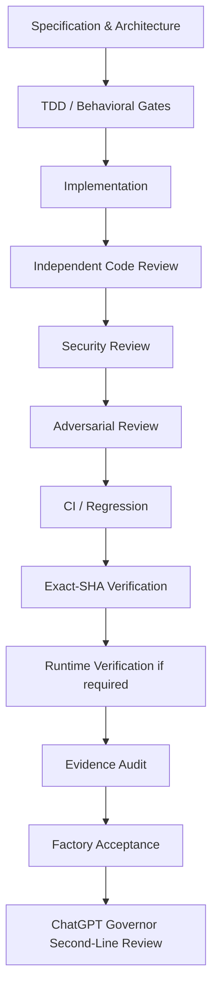
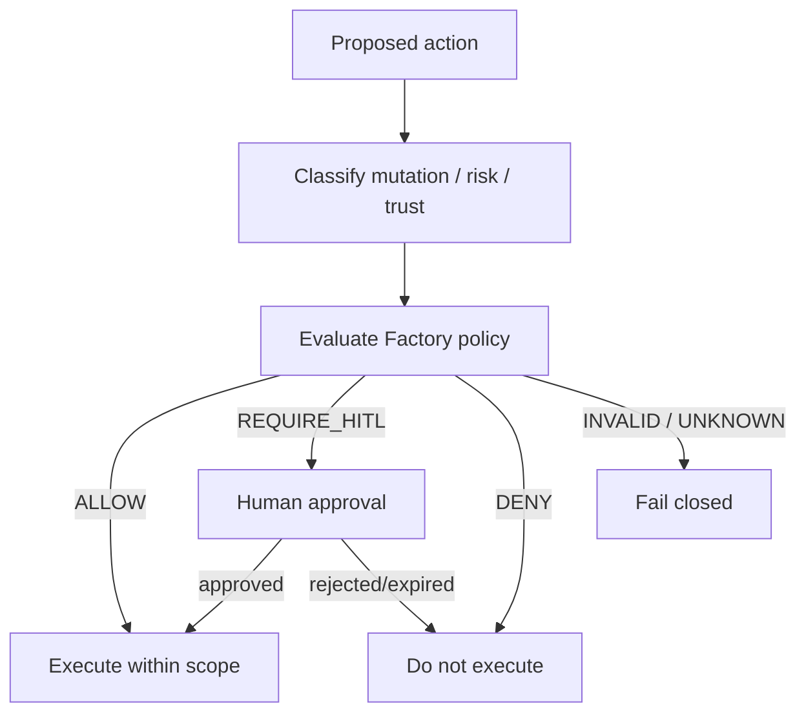
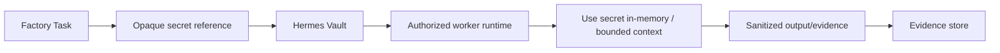
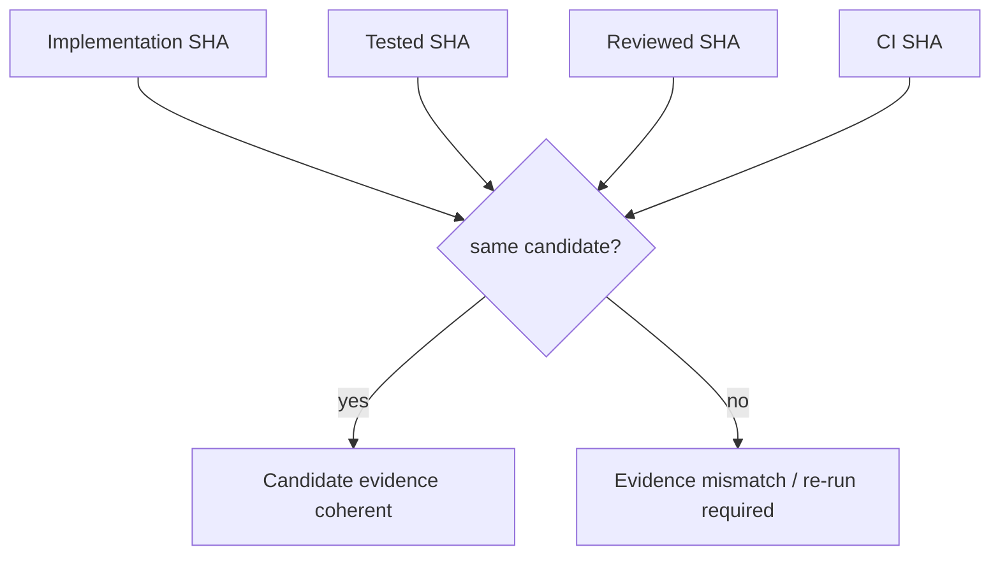
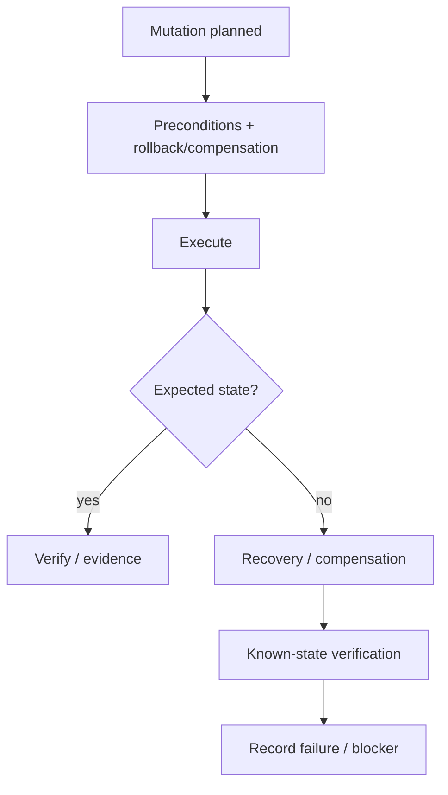

# Hermes Software Factory — Security, Quality & Governance

**Status:** PROPOSED

## Objective

The Factory is allowed to automate delivery only because acceptance is constrained by explicit policy, independent verification and evidence. Autonomy without governance is not the target architecture.

## Core invariants

The following should be treated as Factory-level invariants:

1. `NOT_RUN` is never converted to `PASS`.
2. Repository state does not imply deployed/live state.
3. Agent narrative is not sufficient acceptance evidence.
4. Evidence is bound to the candidate it proves, including exact SHA where applicable.
5. A producer does not solely approve its own high-assurance work.
6. Unknown/invalid protected policy state fails closed.
7. Secrets are never written into normal task descriptions, logs, comments or evidence.
8. Destructive/irreversible actions require policy authorization and, where configured, HITL.
9. A gate that was not executed cannot be marked PASS.
10. Work can be reopened when the acceptance basis becomes stale or contradicted.

## Defense in depth



Not every Work Package requires every gate. The quality profile determines the necessary chain.

## Assurance profiles

Suggested initial profiles:

### `factory-standard`

For normal low/medium-risk software work.

Expected baseline:

- clear acceptance criteria;
- tests;
- code review;
- CI;
- exact candidate identification.

### `factory-high-assurance`

For security-sensitive, infrastructure, identity, secrets, trust, deployment or critical integration work.

Adds as applicable:

- explicit design/spec;
- threat model;
- causal RED;
- independent security review;
- adversarial/fail-closed review;
- stronger segregation of duties;
- evidence provenance review;
- runtime/known-state validation.

### `factory-runtime-critical`

For production-like mutations or operational changes.

Adds:

- runtime preflight;
- approval policy;
- rollback/compensation contract;
- live observation;
- recovery/known-state proof;
- post-action evidence.

## Policy flow



## Human gates

The exact list is project-configurable, but Factory defaults should include strong escalation for:

- direct handling of reusable secret values;
- Shamir shares/root/bootstrap credentials;
- production release/promotion where configured;
- destructive data/resource operations;
- irreversible public visibility/publication decisions;
- unresolved material architecture choice;
- broadening security authority/policy scope;
- accepting significant residual security risk.

Only secret **references/paths/identifiers** should enter normal project metadata where useful.

## Secret handling model



The task/board should not contain the secret value itself.

## Definition of Done as policy

A Work Package's Definition of Done is a machine-evaluable gate set.

Example:

```yaml
definition_of_done:
  specification:
    required: true
    state: PASS

  tdd_red:
    required: true
    state: PASS

  implementation:
    required: true
    state: PASS

  code_review:
    required: true
    independent: true
    state: PASS

  security_review:
    required: true
    independent: true
    state: PASS

  ci:
    required: true
    state: PASS

  exact_sha:
    required: true
    state: PASS

  runtime:
    required: false
    state: NOT_REQUIRED
```

Completion is derived from the gate set; it is not a free-form agent decision.

## Candidate and evidence freshness

Evidence must carry enough identity to decide whether it is still applicable.

For code, at minimum:

```text
repository
branch/PR
commit SHA
check/review identity
timestamp
```

For runtime, examples include:

```text
environment
artifact/revision
service/container/process identity
observation timestamp
observer/tool provenance
```

If the candidate changes materially, stale evidence is invalidated or explicitly re-evaluated by policy.

## Exact-SHA model



Post-merge verification must bind to the actual merged/main revision, not assume the pre-merge head is equivalent.

## Review independence

High-assurance gates should preserve segregation of duties.

Suggested policy:

```yaml
segregation:
  implementation_vs_code_review: required
  implementation_vs_security_review: required
  deployment_vs_runtime_verification: required
  orchestrator_vs_final_acceptance: required
```

Low-assurance profiles may relax selected separations explicitly, never implicitly.

## Fail-closed specialist

A dedicated `factory-fail-closed-inspector` should test states such as:

- missing authorization;
- unknown operation;
- missing/expired credential;
- absent trust;
- malformed policy;
- dependency timeout;
- incomplete evidence;
- unavailable policy service;
- invalid state transition;
- unexpected enum/value.

Expected invariant:

```text
UNKNOWN / INVALID / ABSENT
-> refuse or hold
```

unless the project specification explicitly defines another safe behavior.

## Agent behavior governance

Agent DNA is itself production configuration and therefore versioned/tested.

A new profile/Soul/skill version is not promoted solely because it reads well.

Required lifecycle:

```text
Agent DNA change
-> eval RED/expected deltas
-> implementation/update
-> must-pass/must-refuse/must-find evals
-> regression comparison
-> review
-> versioned promotion
```

## Audit/event model

Important transitions should emit structured events, for example:

- project_compiled;
- work_package_created;
- task_dispatched;
- task_claimed;
- candidate_changed;
- review_requested;
- finding_opened;
- rework_requested;
- gate_passed / gate_failed / gate_not_run;
- hitl_requested / approved / rejected / expired;
- accepted_repo / accepted_live;
- work_reopened;
- evidence_stale;
- project_paused / resumed.

Events support audit and metrics but do not replace canonical external evidence.

## Recovery model

Mutating operations should define their safe recovery posture before execution.



The Factory should prefer reversible changes and bounded blast radius.

## ChatGPT governance

ChatGPT acts as a second-line technical governor rather than a primary worker.

Periodic governance responsibilities:

- compare board state with GitHub/CI/runtime truth;
- challenge PASS/ACCEPTED results;
- inspect evidence freshness;
- verify work was performed as specified;
- reopen cards/work packages when acceptance is invalid;
- identify systemic agent/profile quality problems;
- direct corrective work through the Factory;
- escalate true owner/HITL decisions.

This layer should use a stable Factory Control MCP rather than direct knowledge of private database schemas.

## Security of the Factory itself

HSF must be threat-modeled as privileged orchestration software.

Initial threat areas:

- malicious or compromised project content influencing agents;
- prompt injection in issues/PRs/web content;
- over-broad GitHub credentials;
- cross-project board/workspace leakage;
- profile memory poisoning;
- unauthorized tool/MCP access;
- secret exfiltration through logs/evidence;
- stale approval replay;
- race conditions/double dispatch;
- supply-chain compromise of skills/plugins;
- forged evidence or incorrect identity binding;
- destructive actions caused by faulty decomposition.

HSF's own implementation should therefore be developed under its high-assurance profile once the bootstrap path exists.
