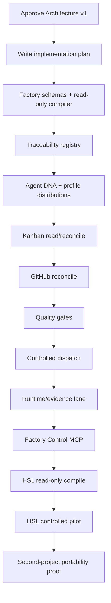

# Hermes Software Factory — Pilot & Roadmap

**Status:** PROPOSED

## Strategy

Hermes Security Labs will be the **first client project**, not the architectural center of the Factory.

The pilot is successful only if the resulting Factory can onboard a second unrelated project without changing its core data model, worker model or governance model.

## Why Hermes Security Labs is a strong pilot

It already exercises most hard engineering cases:

- multiple repositories and dependencies;
- architecture decisions and ADRs;
- governed change records;
- long-running Epics and staged delivery;
- CI and exact-SHA validation;
- repository-vs-runtime evidence separation;
- explicit HITL boundaries;
- security-sensitive operations;
- secrets/Vault integration;
- runtime validation and known-state requirements;
- strong fail-closed expectations.

That makes it an effective stress test for the Factory rather than a simple demo.

## Pilot objective

Prove this end-to-end flow:


## Pilot boundaries

The pilot must not:

- move global Factory Souls into the Labs repo;
- use HSL-specific hard-coded status names in Factory core;
- assume every project has CHG records or PTaaS concepts;
- assume every project requires live/security gates;
- mutate HSL runtime merely to demonstrate the Factory;
- weaken existing HSL governance to simplify onboarding.

## Proposed delivery phases

### Phase 0 — Architecture approval

Deliverables:

- executive proposal;
- reference architecture;
- operating model;
- Agent DNA model;
- project contract/traceability model;
- security/quality/governance model;
- approved ADRs for foundational decisions.

Gate: owner approves the architecture before implementation planning.

### Phase 1 — Factory bootstrap

Goal: establish a runnable but non-autonomous Factory skeleton.

Candidate deliverables:

- `hermes-factory` package/service/plugin skeleton;
- Factory configuration schema;
- project contract schemas;
- Factory state model;
- read-only project compiler prototype;
- read-only inspection of Hermes boards/profiles;
- read-only GitHub reconciliation;
- Factory Control MCP read operations;
- tests and CI.

No autonomous mutation/dispatch is required to prove this phase.

### Phase 2 — Agent Workforce foundation

Deliverables:

- Agent DNA schema;
- profile-distribution packaging convention;
- initial enterprise professions;
- initial routine agents;
- agent version registry;
- eval harness;
- promotion/rollback model for Agent DNA.

Suggested bootstrap workforce:

```text
factory-orchestrator
factory-requirements-engineer
factory-software-architect
factory-security-architect
factory-tdd-red
factory-python-engineer
factory-code-reviewer
factory-security-reviewer
factory-fail-closed-inspector
factory-integration-tester
factory-exact-sha-auditor
factory-evidence-auditor
factory-runtime-truth-observer
factory-release-manager
```

The full catalog grows as real projects require additional professions.

### Phase 3 — Project Compiler + Kanban reconciliation

Deliverables:

- parse/validate `.factory/` contract;
- normalize project sources;
- construct Epics/Work Packages/dependency graph;
- stable/idempotent entity IDs;
- create/reconcile isolated Hermes board;
- staffing assignment;
- task skill attachment;
- worktree policy;
- no duplicate work under repeated compile.

Gate: repeated compilation of unchanged project input yields no unintended mutations.

### Phase 4 — GitHub traceability

Deliverables:

- issue mapping;
- branch/worktree mapping;
- PR mapping;
- candidate SHA tracking;
- CI/check tracking;
- merge SHA tracking;
- stale evidence detection after candidate changes;
- trace traversal Project -> Epic -> WP -> Task -> PR -> SHA -> CI.

### Phase 5 — Quality & rework automation

Deliverables:

- Definition of Done profiles;
- gate engine;
- TDD lifecycle support;
- independent review assignments;
- security/adversarial gates;
- rework orders;
- exact-SHA enforcement;
- acceptance derivation.

### Phase 6 — Runtime/evidence lane

Deliverables:

- runtime evidence model;
- freshness rules;
- policy/HITL integration;
- deployment/runtime observer profiles;
- known-state/recovery gate;
- accepted-repo vs accepted-live distinction.

### Phase 7 — Continuous Factory operations

Deliverables:

- scheduling/dispatch policy;
- locks/concurrency controls;
- project pause/resume;
- blocker/HITL escalation;
- portfolio metrics;
- compact project/factory status reports.

The worker loop runs in Hermes/Jarvas independently of ChatGPT connectivity.

### Phase 8 — ChatGPT Factory Governor

Deliverables:

- stable Factory Control MCP;
- governance-round procedure;
- project/portfolio inspection;
- evidence challenge/reopen capability;
- systemic agent-quality signals;
- owner escalation contract.

ChatGPT periodic automation may operate at the platform-supported schedule, while the Factory itself can run at a finer internal cadence through Hermes scheduling.

### Phase 9 — HSL end-to-end pilot

Onboard `pestoura/hermes-security-labs` through the same public Factory interfaces intended for every future project.

Suggested first action is **read-only reconciliation**:

1. load current canonical HSL project state;
2. build desired Factory graph;
3. compare against existing GitHub issues/PR history and current work;
4. show the proposed board/work packages/staffing without dispatch;
5. owner reviews compilation;
6. enable bounded dispatch only after the graph is accepted.

### Phase 10 — Portability proof

Onboard a second, materially different project.

Success criteria:

- no HSL-specific Factory core changes;
- no redesign of traceability schema;
- project-specific workflow selected via profiles/configuration;
- existing enterprise agents reused where relevant;
- new domain agents added at the edge without changing core orchestration.

## Architecture decision checkpoints

Before implementation, the following should become explicit ADRs:

1. HSF is a native-edge extension over Hermes primitives, not a second agent runtime.
2. Hermes Kanban is the operational task state engine; Factory adds richer semantic/gate state rather than replacing it.
3. One isolated Hermes board per client project.
4. Persistent professions are Hermes profiles/profile distributions.
5. Global Agent DNA lives with the Factory, never in client repos.
6. Client repos expose a `.factory/` contract and retain canonical product intent.
7. GitHub remains canonical for issues/branches/PRs/commits/CI.
8. Runtime state requires fresh runtime evidence.
9. ChatGPT is an external independent Governor, not the only orchestrator keeping the Factory alive.
10. Factory Control MCP is the stable governance interface.

## Initial implementation sequence



## Definition of Factory v1 success

HSF v1 is not complete because a dashboard looks impressive. It is complete when it can demonstrate:

- one command/operation onboards a valid project contract;
- project compilation is deterministic/idempotent;
- the board is correctly reconciled;
- work is traceable to product intent;
- specialized reusable profiles are staffed automatically;
- producer/reviewer separation is enforced where required;
- worktrees prevent unsafe checkout collisions;
- PR/CI/SHA evidence is bound correctly;
- invalid/stale gates prevent acceptance;
- runtime-required work cannot close on repository evidence alone;
- true HITL stops are respected;
- the Factory resumes safely after interruption;
- ChatGPT can independently inspect and reopen work;
- the model works for a second unrelated project.

## Explicitly deferred

Defer until the core workflow is proven:

- elaborate financial costing/chargeback;
- multi-user commercial SaaS tenancy;
- non-Hermes agent runtimes;
- sophisticated predictive delivery analytics;
- automatic recruitment/generated professions without governance;
- autonomous modification of Factory governance rules by worker agents.
