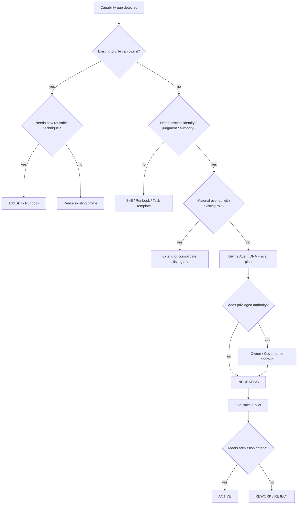
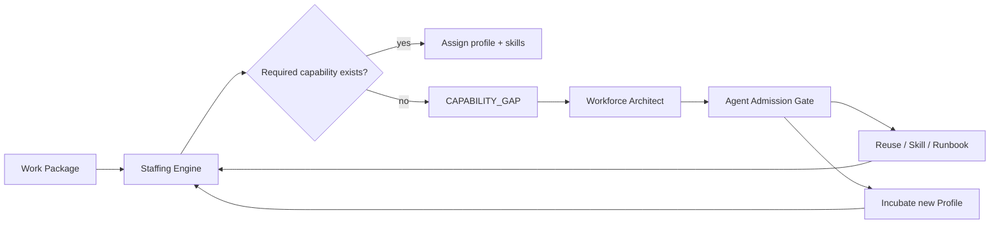

# Hermes Software Factory — Agent Admission & Catalog Governance

**Status:** PROPOSED  
**Purpose:** prevent uncontrolled agent proliferation while allowing the Factory workforce to evolve as real project needs appear.

## Principle

A new Hermes profile is an organizational capability with persistent identity, memory, tools, authority, cost and maintenance burden. It must therefore pass a **Factory Agent Admission Gate** before entering the active workforce catalog.

The default assumption is not "create another agent". The default question is:

> What is the smallest reusable capability that correctly satisfies the need?

Possible outcomes are deliberately broader than `PROFILE_APPROVED`:

```text
USE_EXISTING_PROFILE
ADD_SKILL_TO_EXISTING_PROFILE
ADD_RUNBOOK
ADD_TASK_TEMPLATE
CREATE_ROUTINE_PROFILE
CREATE_PROFESSIONAL_PROFILE
DEFER
REJECT
```

## Agent Admission Gate

Every proposal for a new agent/profile must answer the following questions.

| Gate question | Why it matters |
|---|---|
| Is the responsibility recurrent across projects or repeatedly within one project? | avoids profiles for one-off tasks |
| Does it require specialist judgment rather than a deterministic procedure? | distinguishes Profile from Runbook/Skill |
| Does it need a stable professional identity/Soul? | justifies persistent behavior |
| Does it require different authority/tool permissions from existing profiles? | supports least privilege and segregation of duties |
| Does it require independent approval/review responsibility? | may require a distinct identity |
| Does persistent memory materially improve the role? | justifies profile persistence |
| Can an existing profile perform the work with a new Skill? | prevents duplication |
| Does the proposed role overlap materially with an existing profile? | controls catalog sprawl |
| Can the behavior be evaluated with objective must-pass/must-find/must-refuse cases? | makes Agent DNA governable |
| Is there a clear owner and deprecation path? | prevents abandoned profiles |

### Decision rule

A **professional profile** is favored when the capability is recurrent, requires domain judgment, benefits from a stable Soul/memory, has a distinct authority boundary and participates autonomously in Kanban work.

A **routine profile** is favored when a narrow, repeatable, high-frequency control benefits from an independent identity and strict output contract, for example Exact-SHA auditing or fail-closed inspection.

A **Skill** is favored when an existing profession can perform the technique correctly without requiring a new identity, authority boundary or independent memory.

A **Runbook/task template** is favored when the work is mostly procedural and deterministic.

## Admission flow



## Agent lifecycle

```text
PROPOSED
-> INCUBATING
-> EVALUATING
-> ACTIVE
-> DEPRECATED
-> RETIRED
```

No worker agent may promote itself, broaden its own tool authority, or bypass the admission gate.

## Continuous Workforce Governance

The gate is not only a creation-time control. Workforce governance is continuous.

The Factory should periodically review:

- profiles that have not been used;
- profiles with overlapping responsibilities;
- skills duplicated across profiles;
- high rework/finding rates linked to one profile/version;
- eval regressions;
- permissions broader than current duties require;
- roles that should be merged, split, downgraded to Skills or retired;
- recurring tasks that reveal a genuine missing specialization.

Suggested events:

```text
agent_gap_detected
agent_admission_proposed
agent_admission_decided
agent_version_promoted
agent_version_rolled_back
agent_profile_deprecated
agent_profile_retired
agent_overlap_detected
```

## Workforce Architect

The Factory should include a persistent `factory-workforce-architect` profile.

### Mission

Maintain the coherence and effectiveness of the agent organization.

### Responsibilities

- inspect recurring capability gaps;
- evaluate Profile vs Skill vs Runbook decisions;
- detect role overlap;
- design Agent DNA proposals;
- define eval plans;
- compare agent versions and performance signals;
- propose consolidation/deprecation;
- maintain workforce taxonomy and naming conventions;
- advise the Staffing Engine about available capabilities.

### Authority boundary

The Workforce Architect may **propose** profiles and Agent DNA changes, but must not be the sole approver of its own proposal. Authority-increasing profiles require an independent governance/owner gate.

## Documentation & Developer Experience

The Factory should add `factory-documentation-engineer` as a base professional role.

### Mission

Keep each repository understandable, navigable, correct and usable by developers, operators and technical consumers.

### Responsibilities

- README authoring and maintenance;
- documentation information architecture;
- developer guides and quickstarts;
- architecture and integration documentation;
- configuration references;
- API usage documentation where applicable;
- operational runbooks and troubleshooting;
- release documentation/changelogs;
- Mermaid diagrams and technical visuals;
- documentation impact analysis for code/architecture changes;
- stale/contradictory documentation remediation.

### Recommended skills

```text
readme-authoring
architecture-documentation
api-documentation
operator-runbook
developer-guide
release-notes
troubleshooting-guide
mermaid-diagrams
documentation-audit
```

A separate `factory-docs-consistency-auditor` should **not** be mandatory for v1. Start as a `documentation-audit` skill executed by an independent reviewer or Documentation Engineer. Promote it to a routine profile only if repeated use demonstrates a real segregation/quality benefit.

## Product / UX Design

The current broad workforce needs one additional base profession: `factory-product-designer` (UX/Product Design).

### Why it passes the admission gate

It is recurrent across user-facing products, requires specialist judgment, has different outputs from Product Management and Frontend Engineering, benefits from independent ownership of interaction/design quality and cannot be reduced to a generic frontend skill.

### Responsibilities

- user flows and information architecture;
- interaction design;
- accessibility-aware UI specifications;
- wireframes/prototypes where appropriate;
- design-system guidance;
- usability acceptance criteria;
- review of implemented UX against approved intent.

Frontend engineers implement interfaces; Product Designers define and validate the experience. The two roles should not be conflated by default.

## Other capability gaps reviewed

The following are useful but should remain **conditional/on-demand** until a real project demonstrates the need:

| Capability | Initial treatment |
|---|---|
| Privacy/Data Protection Reviewer | conditional professional profile for personal/sensitive-data projects |
| Accessibility Auditor | Skill under Product Design/QA first; promote only if recurring independent gate is needed |
| API Compatibility / Migration Reviewer | Skill/routine under Integration/Code Review first |
| Database Migration Specialist | Skill under Database Engineer first |
| FinOps / Cloud Cost Reviewer | Skill under Cloud/Platform first |
| Open-source License Compliance | Skill under Supply-Chain/Governance first |
| Localization/i18n Specialist | Skill under Product Design/Frontend first |
| Incident/Recovery Engineer | SRE + recovery runbooks/routine profiles first |
| Test Data Engineer | add only when data-heavy projects demonstrate recurring need |

This classification is intentionally conservative: the Factory should grow from demonstrated work patterns, not from an attempt to model every possible corporate job title in advance.

## Staffing feedback loop

The Staffing Engine and Project Compiler should be able to emit a `CAPABILITY_GAP` rather than inventing a new agent automatically.



The Factory may suggest expansion, but **new organizational authority is never created silently as a side effect of task decomposition**.

## v1 base catalog adjustment

Add to the bootstrap workforce/capability model:

```text
factory-workforce-architect
factory-product-designer
factory-documentation-engineer
```

The rest of the catalog remains demand-driven and subject to this gate.
