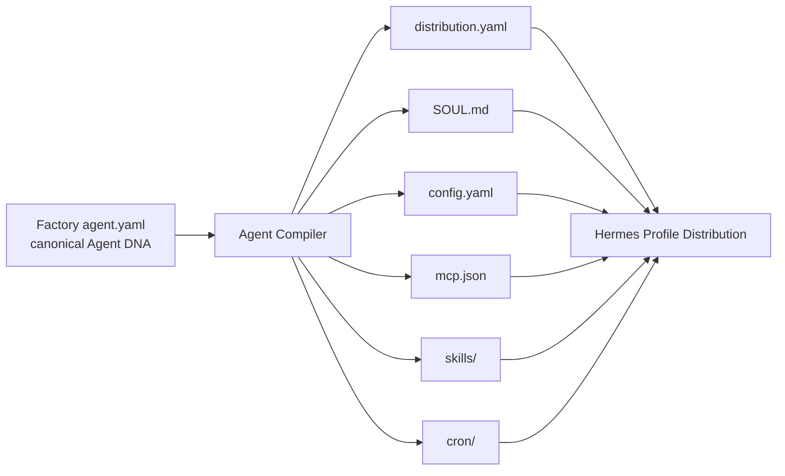

# Hermes Software Factory — Agent DNA Runtime Configuration

**Status:** PROPOSED FOR REVIEW  
**Scope:** design-time definition of Factory profiles; no profile installation or runtime activation is authorized by this document.

## Purpose

Define how a Factory role becomes a real Hermes profile without coupling the Hermes Software Factory to transient implementation details of Hermes Agent.

The design deliberately separates **Factory Agent DNA** from **Hermes-native profile distribution files**.



## Why this split is necessary

Hermes profiles are the correct runtime substrate: each profile has its own `config.yaml`, `.env`, `SOUL.md`, memories, sessions, skills, cron jobs and state. Hermes Profile Distributions already package `distribution.yaml`, `SOUL.md`, `config.yaml`, `mcp.json`, `skills/` and `cron/` as a versioned Git distribution.

However, the Factory also needs semantics that Hermes does not need to own directly: organizational authority, segregation-of-duties classes, acceptance permissions, Agent Admission lifecycle, model capability classes, quality gates and evaluation requirements.

Therefore:

```text
Factory Agent DNA = canonical organizational definition
Hermes Distribution = compiled/deployable runtime representation
```

## Proposed agent package

Design-source layout:

```text
agents/<agent-id>/
├── agent.yaml                 # Factory canonical Agent DNA
├── SOUL.md                    # Hermes-native identity prompt
├── distribution.yaml         # Hermes-native distribution manifest
├── config.yaml               # Hermes-native runtime config
├── mcp.json                   # Hermes-native MCP connections
├── skills/                    # Hermes-native reusable skills
├── cron/                      # Hermes-native schedules, only where justified
├── evals/                     # Factory evaluation corpus
│   ├── must-pass.yaml
│   ├── must-find.yaml
│   ├── must-refuse.yaml
│   ├── must-escalate.yaml
│   └── regression.yaml
└── README.md                  # human-facing role documentation
```

`.env`, `auth.json`, memories, sessions, runtime DBs and logs are never authored into the distribution.

## Canonical `agent.yaml`

Proposed schema:

```yaml
schema: hermes.factory/agent/v1

agent:
  id: factory-security-reviewer
  version: 1.0.0
  kind: professional
  department: security-engineering
  lifecycle: proposed
  description: >
    Independently reviews security-sensitive software changes and produces
    evidence-bound findings without modifying the implementation under review.

routing:
  capabilities:
    - secure-code-review
    - authorization-review
    - trust-boundary-review
    - secrets-review
  work_types:
    - security_review
    - high_assurance_review

model_policy:
  class: reasoning-high
  fallback_class: reasoning-standard
  temperature_policy: low

memory:
  mode: professional
  project_memory_allowed: true
  secrets_allowed: false
  canonical_authority: false

authority:
  repository:
    read: true
    write: false
  pull_request:
    read: true
    comment: true
    approve: policy_controlled
    request_changes: true
    merge: false
  kanban:
    read: true
    comment: true
    transition_review_result: true
    create_implementation_work: false
  runtime:
    observe: false
    mutate: false
  secrets:
    resolve_references: false
    read_values: false

independence:
  may_implement_same_candidate: false
  may_self_approve: false
  incompatible_roles:
    - candidate-implementer

skills:
  required:
    - secure-code-review
    - fail-closed-reasoning
  optional:
    - oauth-security
    - api-security

mcp_policy:
  allow:
    - factory-control-read
    - github-review
  deny:
    - runtime-mutation
    - secret-material

gates:
  can_satisfy:
    - security_review
  cannot_satisfy:
    - implementation
    - runtime_verification
    - final_owner_acceptance

outputs:
  contract: security-review/v1
  terminal_states:
    - PASS
    - PASS_WITH_FINDINGS
    - REWORK_REQUIRED
    - BLOCKED

escalation:
  - unapproved_authority_expansion
  - material_architecture_conflict
  - secret_exposure
  - destructive_operation

evals:
  required_classes:
    - must-find
    - must-refuse
    - must-escalate
    - no-unapproved-mutation
    - output-contract
```

This file is read by the Factory, not by Hermes core.

## Hermes-native `distribution.yaml`

The Agent Compiler projects Factory metadata into a normal Hermes Profile Distribution.

Conceptual output:

```yaml
name: factory-security-reviewer
version: 1.0.0
description: "Independent high-assurance software security reviewer"
hermes_requires: ">=<validated-version>"
author: "Hermes Software Factory"

distribution_owned:
  - SOUL.md
  - config.yaml
  - mcp.json
  - skills/
  - cron/
```

The exact `hermes_requires` version is pinned only after validation against the Hermes/Jarvas runtime actually deployed.

## Profile description and routing

Hermes Kanban can route work using the profile description. The generated description must therefore be **short, discriminative and operational**, not marketing prose.

Good:

```text
Independently reviews code for security, authorization, trust and fail-closed defects. Does not implement fixes.
```

Bad:

```text
World-class security expert who helps with everything security-related.
```

The Factory owns a richer routing taxonomy in `agent.yaml`; the Hermes description is a compact projection.

## `SOUL.md` contract

Every Factory Soul follows the same structure:

```text
IDENTITY
MISSION
SUCCESS CRITERIA
PROFESSIONAL POSTURE
SOURCE-OF-TRUTH RULES
MANDATORY METHOD
INVARIANTS
AUTHORITY BOUNDARY
NEVER
ESCALATE WHEN
OUTPUT DISCIPLINE
```

A Soul expresses professional judgment and behavior. It **never grants authority**.

Authority comes from runtime configuration, tool/MCP exposure, credentials, Factory policy and project gates.

### Soul invariant baseline

All Factory Souls inherit these statements conceptually:

```text
- Never treat another agent's narrative as sufficient proof.
- Never convert NOT_RUN or UNKNOWN into PASS.
- Never claim live/runtime state from repository evidence.
- Never expose secret values in normal task output.
- Never exceed the explicit Work Package scope.
- Never silently broaden authority or architecture.
- Stop/escalate when policy requires HITL.
- Preserve provenance for material claims.
```

Individual roles add stronger restrictions.

## Runtime `config.yaml`

Hermes configuration is profile-scoped. The Factory must generate it from policy instead of giving every worker the default full Hermes CLI toolset.

Important current Hermes rule: the deprecated top-level `toolsets` key must not be used; per-platform tool exposure is configured through `platform_toolsets` or equivalent supported configuration.

Conceptual generated profile:

```yaml
model:
  default: "<resolved-from-model-policy>"
  provider: "<resolved-provider>"

terminal:
  backend: local
  cwd: "."
  home_mode: profile
  timeout: 180

platform_toolsets:
  cli:
    - file
    - terminal
    - skills
    - todo

worktree: true
```

This example is **not a universal template**. Review-only agents should not receive write-capable terminal/file paths merely because implementers need them.

## Model policy

Agent DNA should not hard-code a model vendor unless the role technically requires it.

Instead, roles request a model capability class:

```text
reasoning-high
reasoning-standard
coding-high
coding-standard
fast-verifier
vision-capable
long-context
```

Jarvas/Factory resolves that class to an installed/approved model.

Example:

```yaml
model_classes:
  reasoning-high:
    primary: <configured-frontier-reasoning-model>
    fallback: <configured-secondary-reasoning-model>

  coding-high:
    primary: <configured-coding-model>
    fallback: <configured-frontier-reasoning-model>
```

Benefits:

- model changes do not rewrite every Soul;
- cost/performance can be governed centrally;
- model regressions can be evaluated by role;
- a profile's professional identity is not a model name.

## Terminal and filesystem authority

Hermes profiles isolate Hermes state, but a Profile is **not a security sandbox**. On a local backend, workers execute with the OS user's filesystem authority unless stronger controls are applied.

Factory rules:

1. Use worktrees for Git-mutating engineering work.
2. Use explicit `terminal.cwd`/workspace binding per dispatched task.
3. Prefer `home_mode: profile` for workers requiring isolated CLI identity/state.
4. Use Docker or another sandbox backend when project/risk policy requires filesystem/process isolation.
5. Do not rely on `SOUL.md` to prevent filesystem access.
6. Credentials must match role authority, not be shared indiscriminately because profiles run on the same host.

## Tool policy classes

The Factory should define reusable tool-policy classes.

### `control-read`

For auditors/governors:

```text
Kanban read
Factory Control read
GitHub read
CI read
Evidence read
No implementation mutation
No runtime mutation
```

### `review`

```text
repository read
PR read/comment/request-changes
CI read
no code mutation
no merge
```

### `engineering-worktree`

```text
scoped worktree read/write
terminal/test execution
GitHub branch/PR creation under policy
no release/runtime authority
```

### `runtime-observe`

```text
runtime health/status/log/evidence read
no deployment/config mutation
```

### `release-controlled`

```text
release/deployment capability
requires governance/HITL policy
no bypass of acceptance gates
```

These are Factory abstractions compiled into supported Hermes toolsets/MCPs and credential scopes.

## MCP policy

`mcp.json` is generated from an allowlist in Agent DNA.

Principles:

- expose only MCPs required for the profession;
- split read and mutation surfaces when technically possible;
- never expose secret-returning operations to profiles that do not require secret material;
- reviewers should not automatically inherit implementer MCPs;
- runtime observers receive observation MCPs, not mutation MCPs;
- Factory Control MCP should expose role-scoped operations.

## Skills

Skills are techniques, not identities.

Examples:

```text
factory-documentation-engineer
  + readme-authoring
  + architecture-documentation
  + mermaid-diagrams

factory-security-reviewer
  + secure-code-review
  + fail-closed-reasoning
  + oauth-security [task-specific]
```

The Staffing Engine may attach optional skills to a task without changing the profile's Soul.

## Cron

Cron is used only where the role has a real recurring responsibility.

Examples that may justify schedules:

- workforce catalog health scan;
- documentation drift scan;
- portfolio/release readiness scan.

Do not give every employee its own cron merely because Hermes supports it. Project execution remains driven primarily by Kanban/dispatcher work.

## Memory policy

Three memory classes are proposed:

### `none/minimal`

For narrow robotic assurance stations where persistent memory could bias deterministic verification.

Examples: Exact-SHA Auditor.

### `professional`

Reusable techniques, lessons and role-specific preferences may persist.

Examples: Software Architect, Documentation Engineer.

### `professional+project`

Can retain project orientation/context but may not turn memory into source-of-truth.

Examples: Orchestrator, Requirements Engineer.

Universal rules:

```text
memory != canonical project truth
memory != GitHub truth
memory != runtime truth
memory must not contain reusable secret values
```

## Output contracts

Each role has machine-readable output expectations.

Example review output:

```yaml
schema: hermes.factory/output/security-review/v1
work_package: HSF-WP-0123
candidate_sha: abcdef...
result: REWORK_REQUIRED
findings:
  - id: SEC-01
    severity: high
    evidence: ...
    required_action: ...
confidence: high
```

Narrative prose may accompany the contract but cannot replace required structured fields.

## Agent evaluation

Every active Agent DNA version must pass role-appropriate evals.

Core classes:

```text
must-pass
must-find
must-refuse
must-escalate
no-unapproved-mutation
source-authority
output-contract
regression
```

Agent promotion is blocked if a new Soul/config/tool change materially weakens a required safety or quality behavior.

## Version identity

Every execution should preserve:

```yaml
agent_identity:
  id: factory-security-reviewer
  version: 1.0.0
  agent_digest: sha256:...
  soul_digest: sha256:...
  runtime_config_digest: sha256:...
  skills:
    secure-code-review: 1.0.0
```

This allows correlation between bad outcomes and exact Agent DNA versions.

## Installation lifecycle

Target lifecycle after implementation approval:


No Agent DNA file in this design branch is considered ACTIVE until that lifecycle has actually executed.

## Proposed implementation boundary

When Architecture v1 is accepted, implementation should create an Agent Compiler that:

1. validates `agent.yaml`;
2. resolves model/tool/MCP policy classes;
3. generates Hermes-native distribution files;
4. rejects secrets and runtime state from authored packages;
5. computes digests;
6. executes evals;
7. installs only approved versions;
8. records deployment/provenance.

This lets the Factory treat its workforce as versioned software rather than manually maintained prompt folders.
