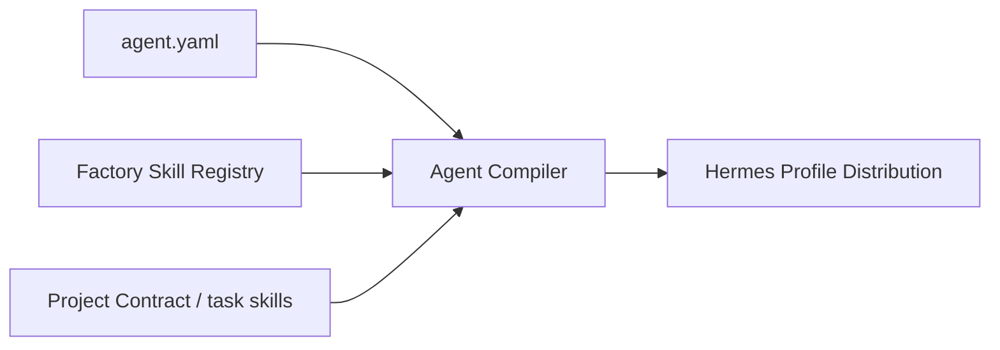
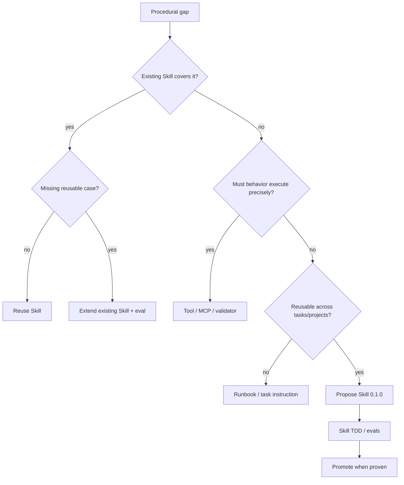

# Hermes Software Factory — Skills Architecture v1

**Status:** PROPOSED FOR REVIEW  
**Compatibility target:** NousResearch Hermes Agent Skills / agentskills.io  
**Promotion rule:** new Factory Skills start at `0.1.0`; `1.0.0` requires skill-eval evidence.

## Principle

The Soul defines **who an agent is**. Agent DNA defines **what authority it has**. A Skill defines **how it performs a reusable technique**. Project context defines **where that technique is being applied now**.

```text
SOUL          = professional identity and posture
Agent DNA     = authority, tools, memory, gates and role contract
SKILL.md      = reusable procedural knowledge
Project       = canonical intent and local constraints
Work Package  = bounded assignment and acceptance criteria
```

Skills are therefore first-class production assets of the Factory. They are versioned, reviewed and evaluated; they are not informal prompt fragments.

## Native Hermes model

Factory Skills adopt the Hermes Agent model directly:

```text
skills/<category>/<skill-name>/
├── SKILL.md
├── references/     # optional heavy reference
├── templates/      # optional reusable templates
└── scripts/        # optional deterministic helpers
```

Every `SKILL.md` uses Hermes-compatible frontmatter:

```yaml
---
name: writing-causal-red-tests
description: Write causal failing tests for missing behavior.
version: 0.1.0
author: Pedro Estoura (pestoura), Hermes Agent
license: MIT
platforms: [linux, macos, windows]
metadata:
  hermes:
    tags: [testing, tdd, red]
    related_skills: []
  factory:
    lifecycle: proposed
    test_status: not_run
---
```

Factory hardline follows upstream Hermes conventions:

- name is lowercase/hyphenated;
- description is one capability sentence, <= 60 characters;
- frontmatter starts at byte zero;
- no marketing language;
- no machine-local paths;
- use Hermes tools in procedures rather than raw wrapped shell equivalents;
- use progressive disclosure;
- keep heavy reference/support material outside `SKILL.md`;
- steps end in checkable completion criteria;
- no router/index Skills whose only job is to point at other Skills;
- prefer a deterministic Tool/MCP when the behavior must execute precisely rather than be interpreted procedurally.

## Four scopes of procedural knowledge

### 1. Factory Core Skills

Reusable by many departments and projects. Examples:

```text
reading-project-truth
scoping-bounded-work
producing-evidence-handoffs
reconciling-traceability
assessing-change-impact
```

They live once in the Factory source tree. Agent distributions select them; they are never hand-copied and independently edited per Profile.

### 2. Professional / Department Skills

Reusable techniques primarily owned by one or a few professions:

```text
baselining-requirements
making-architecture-decisions
threat-modeling-changes
designing-product-experience
authoring-repository-documentation
reviewing-code-independently
reviewing-security-independently
```

### 3. Routine Assurance Skills

Narrow disciplines where consistency matters more than broad creativity:

```text
writing-causal-red-tests
inspecting-fail-closed-behavior
verifying-exact-sha
auditing-evidence-provenance
observing-runtime-truth
```

### 4. Project / Domain Skills

Technology- or project-specific knowledge is loaded only when justified, for example `fastapi`, `oidc`, `vault-transit`, `kubernetes-network-policy`, or a project-local operating procedure. These are not promoted to global Factory Skills solely because one project uses them.

Project-scoped Skills may be declared by the project contract and attached to relevant Hermes Kanban tasks. They do not alter the global Agent Soul.

## Skill selection

An Agent Distribution is compiled from central sources:



`agent.yaml` separates:

```yaml
skills:
  required:
    - reading-project-truth
    - producing-evidence-handoffs
  optional:
    - assessing-change-impact
  forbidden: []
```

Required Skills are part of the role contract. Optional Skills are loaded by task/project need. A task may add a Skill, but may not silently broaden the Profile's authority.

## Skill Admission Gate

A capability gap does not automatically become a new Skill.



Gate outcomes:

```text
REUSE_EXISTING_SKILL
EXTEND_EXISTING_SKILL
ADD_RUNBOOK_OR_TEMPLATE
IMPLEMENT_TOOL_OR_MCP
CREATE_SKILL_DRAFT
DEFER
REJECT
```

## Skill TDD and lifecycle

Skill authoring follows RED-GREEN-REFACTOR applied to procedural documentation.

```text
PROPOSED 0.1.0
-> BASELINE_RED        # agent fails/omits/misapplies without Skill
-> SKILL_GREEN         # same scenario succeeds with Skill
-> PRESSURE_EVAL       # edge/ambiguous/adversarial variants
-> REVIEWED
-> ACTIVE 1.0.0
-> subsequent semver evolution
```

For every new Skill, evidence must answer:

1. What observable failure occurs without the Skill?
2. What exact behavior should the Skill change?
3. Does the same scenario succeed with the Skill loaded?
4. Does it work on variations, not just the authored example?
5. Does it know when **not** to apply itself?
6. Does it stay within the Profile's authority boundary?

A Skill with `test_status: not_run` may be reviewed as a draft but is not eligible to satisfy an acceptance gate.

## Progressive disclosure

The description exists for discovery, not as a mini-procedure. The agent should read the `SKILL.md` when the trigger matches. The body remains concise; heavy API/reference material is loaded only when required.

This avoids two failure modes:

- every agent carrying every procedure permanently in its system prompt;
- descriptions becoming shortcuts that cause the agent to skip the actual Skill.

## Shared vs specific ownership

A Skill may be used by many profiles while retaining one accountable owner.

Example:

```yaml
factory_skill:
  owner: factory-quality-engineering
  consumers:
    - factory-tdd-red
    - factory-python-engineer
    - factory-code-reviewer
```

Ownership controls maintenance; consumption controls loading. Shared does not mean unowned.

## Version binding

Every execution manifest should be able to record:

```yaml
skills:
  - name: writing-causal-red-tests
    version: 1.0.0
    digest: sha256:...
```

An acceptance result can therefore be traced not only to an Agent version, but to the exact procedural knowledge used by that Agent.

## Updates and compatibility

A Skill update does not silently rewrite historical evidence. New tasks use the currently approved compatible version; in-flight work remains pinned where reproducibility requires it. Breaking procedural changes require a major version or explicit compatibility decision.

## Skill quality review

The Factory Workforce Architect monitors:

- overlapping Skills;
- unused Skills;
- recurring task instructions that should become Skills;
- Skills that should become deterministic Tools;
- Skill-induced rework/failure rates;
- stale references or commands;
- agent versions depending on deprecated Skills.

The Documentation Engineer reviews clarity and information architecture; the domain owner validates technical correctness; assurance roles validate behavior through evals.

## v1 initial registry

The initial Factory Skill drafts are grouped as follows:

**Core:** `reading-project-truth`, `scoping-bounded-work`, `producing-evidence-handoffs`, `reconciling-traceability`, `assessing-change-impact`.

**Control/Workforce:** `decomposing-approved-work`, `governing-agent-admission`.

**Product/Architecture:** `baselining-requirements`, `making-architecture-decisions`, `threat-modeling-changes`, `designing-product-experience`.

**Documentation:** `authoring-repository-documentation`, `validating-documentation-consistency`.

**Engineering/Quality:** `writing-causal-red-tests`, `implementing-minimal-green`, `implementing-python-changes`, `reviewing-code-independently`, `verifying-integration-behavior`.

**Security/Assurance:** `reviewing-security-independently`, `inspecting-fail-closed-behavior`.

**Governance/Operations:** `verifying-exact-sha`, `auditing-evidence-provenance`, `observing-runtime-truth`, `coordinating-governed-releases`.

All begin as `0.1.0 / PROPOSED / NOT_RUN` until their skill-eval cycle is executed.
