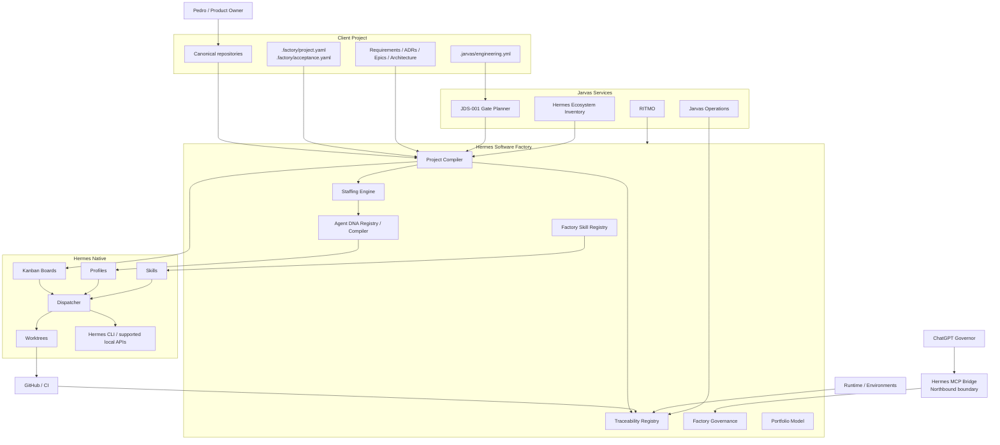

# Hermes Software Factory — Architecture Review v1.1

**Status:** ACCEPTED_WITH_CHANGES  
**Date:** 2026-08-18  
**Decision owner:** Pedro Estoura  
**Scope:** design correction before implementation  
**Implementation authority:** NOT GRANTED by this review

## Purpose

This review reconciles the initial Hermes Software Factory design with capabilities already present in the Hermes/Jarvas ecosystem. The objective is to reduce duplicated infrastructure, strengthen source-of-truth boundaries and keep the Factory focused on engineering semantics, workforce governance and evidence-derived acceptance.

## Executive conclusion

The Factory remains the correct product direction, but its internal implementation should be smaller than originally proposed.

The ecosystem already provides mature execution primitives:

- Hermes Kanban, Profiles, Skills, Dispatcher and Worktrees;
- Jarvas Engineering Platform / JDS-001 for deterministic engineering gate planning;
- Jarvas Operations for independent assurance and bounded recovery;
- Git/GitHub for SCM truth;
- RITMO for scheduled/recurring execution intent;
- Hermes Ecosystem Architecture for portfolio capability/provenance inventory;
- Hermes MCP Bridge as the northbound external control boundary from ChatGPT/external clients into Jarvas.

The Factory therefore owns the semantic layer that turns project intent into governed engineering work.

## v1.1 target architecture



## Accepted corrections

### AR-01 — JDS-001 is the canonical generic quality/gate planner

The Factory MUST NOT build a second generic quality engine for language, repository, security, packaging and CI capability selection where JDS already owns that problem.

Canonical flow:

```text
.jarvas/engineering.yml
        -> JDS-001
        -> Effective Gate Plan
        -> Factory Compiler
        -> Work Packages / Kanban gates
```

`.factory/quality.yaml` is removed from the recommended generic project contract. If a Factory-specific quality overlay is needed, it must contain only semantics not already represented by JDS and must not silently override mandatory JDS controls.

### AR-02 — MCP Bridge is northbound only

Formalized by ADR-0014.

Internal Factory execution uses supported local Hermes/Jarvas interfaces. The normal path `Factory -> MCP Bridge -> Hermes` is rejected when a supported native local interface exists.

### AR-03 — Factory owns its professional Skills

Formalized by ADR-0015.

Hermes provides the Skill format, discovery, loading, profile/task integration and lifecycle mechanics. The Factory owns the professional content, versions, evals, admission and authorization of Factory Skills.

Installed server-wide Skills are references/toolbox capabilities; they are not automatically authorized for Factory agents.

### AR-04 — Exact-SHA is a deterministic gate, not a persistent LLM profession

Candidate identity reconciliation is deterministic and MUST be implemented as a machine gate/validator.

Canonical outputs:

```text
SHA_MATCH
SHA_MISMATCH
EVIDENCE_STALE
EVIDENCE_ABSENT
IDENTITY_UNKNOWN
```

Agents such as Evidence Auditor or Release Manager may interpret the result, but must not replace the deterministic comparison.

`factory-exact-sha-auditor` is removed from the v1.1 active-candidate workforce.

### AR-05 — Generalize the implementation profession

`factory-python-engineer` is too technology-specific for the base company workforce.

The v1.1 base profession is:

```text
factory-software-engineer
```

Language/framework specialization is normally attached through approved Skills such as Python, TypeScript, Go or .NET. A language-specific persistent profile requires a future Agent Admission Gate decision based on recurring need, distinct authority/context or materially different eval behavior.

### AR-06 — Add Platform Engineering as a real profession

A genuine workforce gap exists between software implementation, architecture, release management and independent operations assurance.

Add:

```text
factory-platform-engineer
```

This role implements bounded CI/CD, container, infrastructure-as-code, service-management, Kubernetes/deployment and observability configuration changes under project policy.

It does not replace Jarvas Operations. Jarvas Operations remains the independent assurance/recovery plane and must not be collapsed into the implementation workforce.

### AR-07 — Hermes Kanban remains the only Factory execution queue

No Factory task engine, dispatcher or workspace manager will be created.

The Factory adds semantic Work Packages, gate state, staffing and traceability above native Hermes Kanban.

For high-assurance Factory boards, the initial baseline is:

```yaml
kanban:
  auto_decompose: false
  dispatch_approval_mode: structured
```

This prevents autonomous triage decomposition from bypassing deliberate containment and ensures promotion/dispatch/review transitions are bound to structured approval in the hardened fork.

The baseline may be relaxed only after an explicit evidence-backed design change.

### AR-08 — Hermes upstream reconciliation is a mandatory platform gate

The `pestoura/hermes-agent` fork contains security/governance hardening that must survive upstream updates.

No production Factory baseline may update Hermes by blindly tracking upstream `main`.

Required lifecycle:

```text
new upstream release
-> reconciliation branch
-> merge/rebase/cherry-pick analysis
-> upstream test suite
-> fork hardening regression suite
-> Kanban dispatch-approval tests
-> containment/auto-decompose tests
-> candidate exact SHA
-> staging/runtime smoke
-> accepted platform baseline
```

### AR-09 — Jarvas Operations stays outside the Factory failure domain

Factory runtime observers may collect/read runtime evidence but must not inherit Jarvas Operations recovery authority merely because they observe a fault.

Implementation and independent recovery/assurance remain separated.

### AR-10 — RITMO schedules Factory work; it does not replace Kanban

Canonical separation:

```text
RITMO        = when recurring work should be initiated
Hermes Kanban = what operational work is currently executable
Factory       = why the work exists, who performs it and what proves acceptance
```

Suitable RITMO uses include periodic reconciliation, Skill/Agent eval campaigns, portfolio checks, upstream checks and scheduled assurance campaigns.

### AR-11 — Factory UI extends the Hermes Dashboard

The preferred v1 UI is a Hermes Dashboard plugin rather than a separate web application.

It should augment native Kanban with Factory semantics such as Epic, WP, Requirement, PR/SHA, JDS gates, Agent DNA version, Skill versions, evidence and acceptance state, plus a portfolio view.

### AR-12 — Ecosystem inventory is a compiler input

The Project Compiler should consult the machine-readable Hermes ecosystem inventory before inventing a new platform dependency or capability.

A requested capability may resolve to:

```text
AVAILABLE
IMPLEMENTED_NOT_DEPLOYED
PLANNED
BLOCKED
UNKNOWN
```

and staffing/compilation must respect that state.

## Revised v1.1 workforce

The base active-candidate catalog contains 17 Profiles:

```text
factory-orchestrator
factory-workforce-architect
factory-requirements-engineer
factory-software-architect
factory-security-architect
factory-product-designer
factory-documentation-engineer
factory-tdd-red
factory-software-engineer
factory-platform-engineer
factory-code-reviewer
factory-security-reviewer
factory-fail-closed-inspector
factory-integration-tester
factory-evidence-auditor
factory-runtime-truth-observer
factory-release-manager
```

Changes from v1:

```text
factory-python-engineer      -> superseded by factory-software-engineer
factory-exact-sha-auditor    -> replaced by deterministic Exact-SHA Gate
factory-platform-engineer    -> added
```

This is a catalog, not a permanently running fleet. Project Compiler staffing activates only the professions required for current Work Packages.

## Revised project contract

Recommended v1.1 project-level contract:

```text
.factory/
├── project.yaml
└── acceptance.yaml

.jarvas/
└── engineering.yml
```

Responsibilities:

```text
.factory/project.yaml     = Factory identity, canonical sources, board/workflow, autonomy
.factory/acceptance.yaml  = Factory acceptance classes and HITL boundaries
.jarvas/engineering.yml   = JDS-001 capabilities, risk/criticality and generic engineering gates
```

No file may silently weaken mandatory controls owned by another authority.

## Revised Factory component set

The Factory v1 implementation should be limited to:

```text
Project Compiler
Semantic Traceability Registry
Staffing Engine
Agent DNA Compiler / Registry
Factory Skill Registry / Eval Harness
JDS Adapter
Hermes Kanban Adapter
Git/GitHub Adapter
Jarvas Operations Evidence Adapter
Ecosystem Capability Adapter
Factory Governance / Acceptance
Hermes Dashboard Plugin
External Factory Control contract
```

Explicit non-components:

```text
no second Kanban engine
no second dispatcher
no generic DAG/runbook engine
no internal MCP transport requirement
no second generic CI/gate platform
no replacement operations recovery plane
no standalone Factory web application for v1
```

## Jarvas CLI design implication

A unified `jarvas` CLI is considered a high-value future control-plane client, but it MUST compose existing authorities rather than duplicate them.

The intended boundary is:

```text
hermes ...       = Hermes runtime/profile/kanban/skill/tool operations
jarvas-ops ...   = independent host/service assurance and bounded recovery
jarvas ...       = ecosystem/factory control and reconciliation client
```

Candidate `jarvas` command families are captured in the v1.1 canonical specification. This review does not authorize their implementation.

## Review verdict

The Factory architecture is **ACCEPTED_WITH_CHANGES** under this v1.1 review. Historical v1 documents remain useful design history, but where they conflict with this review or ADR-0014/ADR-0015, v1.1 takes precedence.

Implementation remains blocked until the v1.1 canonical specification and implementation plan are reviewed under the normal design/spec -> plan -> TDD workflow.
