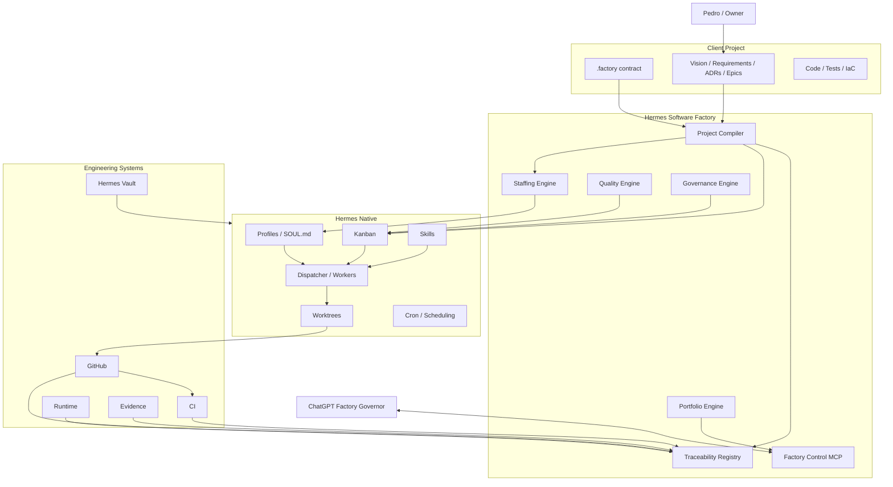
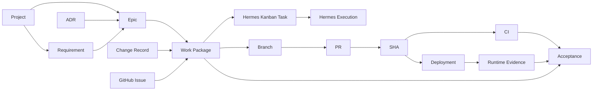
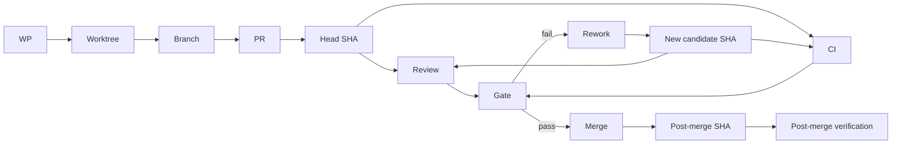
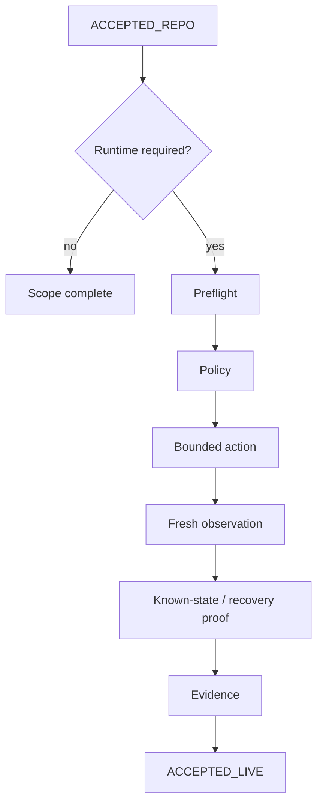

# Hermes Software Factory — Architecture & Operating Model v1

**Status:** PROPOSED FOR OWNER REVIEW  
**Date:** 2026-08-18  
**Repository:** `pestoura/hermes-factory`

## 1. Problem statement

Pedro's Hermes/Jarvas ecosystem already provides a capable autonomous agent runtime and the upstream Hermes Agent project provides a powerful native Kanban, persistent profiles, skills, workspaces/worktrees, dispatcher execution, review flows, memory and scheduling.

The missing capability is not another coding agent or another task board. The missing capability is a **reusable engineering organization** that can receive a project designed by its owner, understand the project's canonical intent, convert that intent into governed executable work, staff specialized persistent agents, drive implementation and verification, and maintain traceability from product intent to runtime acceptance.

The Factory must be reusable across projects. No client project may become the location of global Factory agents, Souls, workflows or governance.

## 2. Product vision

Hermes Software Factory (HSF) is an autonomous software-engineering operating layer built natively on Hermes primitives.

Target owner experience:

```text
Pedro + ChatGPT design project
-> approved decisions committed to project repository
-> project exposes a small .factory contract
-> "Entrega à Factory"
-> Factory compiles the project
-> isolated Hermes board is created/reconciled
-> Epics become governed Work Packages/tasks
-> specialized persistent profiles are staffed
-> engineering/review/runtime work proceeds continuously
-> real blockers/HITL are escalated
-> ChatGPT periodically performs independent governance
-> acceptance is evidence-derived, not agent-declared
```

## 3. Architectural principles

### P1 — Native Hermes first

Reuse Hermes profiles, Souls, skills, Kanban, dispatcher, worktrees, review mechanisms, cron and tools before adding new execution primitives.

### P2 — Factory at the edge

The Factory should be a separate product/service/plugin/MCP integration, not project-specific code embedded into Hermes core.

### P3 — Projects own intent

Client repositories own product intent, requirements, architecture decisions, code, tests and project-specific operating context.

### P4 — Factory owns organizational policy

HSF owns enterprise agent definitions, staffing, quality profiles, traceability, project compilation, governance and portfolio control.

### P5 — One operational board per project

Each Factory-managed project receives an isolated Hermes Kanban board.

### P6 — Explicit evidence classes

Repository acceptance, integration acceptance, live acceptance and campaign/release acceptance are separate states.

### P7 — Source authority is domain-specific

- project artifacts govern intent;
- current repo/exact SHA governs implementation;
- Hermes Kanban governs operational task state;
- GitHub governs SCM state;
- CI governs the checks it actually executed;
- fresh runtime observation governs live state;
- an agent's narrative is supporting information only.

### P8 — No silent inference across authority boundaries

Repository GREEN cannot silently become runtime GREEN. `NOT_RUN` cannot become `PASS`. Evidence for one SHA does not prove another candidate.

### P9 — Autonomous continuation, explicit escalation

Safe accepted transitions continue automatically. Mandatory HITL, secrets, destructive actions, external blockers, material security/recovery risk and unresolved structural decisions stop progression.

### P10 — Independent validation

High-assurance work separates producer, reviewer, security verifier, runtime verifier and final acceptance roles as required by policy.

## 4. System context



## 5. Factory Project Contract

Each project exposes:

```text
.factory/
├── project.yaml
├── quality.yaml
└── acceptance.yaml
```

The contract points to canonical artifacts rather than duplicating them.

Required project-level concepts:

- project identity;
- repository set and roles;
- source locations for architecture/requirements/decisions/roadmap;
- board identity;
- workflow profile;
- quality profile;
- autonomy profile;
- runtime environments where applicable;
- mandatory human gates.

The contract itself is versioned with the project.

## 6. Project Compiler

The compiler is the bridge from product intent to operational work.

### Inputs

- Factory contract;
- canonical project sources;
- current repository revision;
- GitHub Issues/PRs/commits/CI state;
- existing Factory registry;
- existing Hermes board state.

### Outputs

- normalized project model;
- milestones/Epics;
- Work Packages;
- dependency DAG;
- gate assignments;
- staffing plan;
- traceability links;
- idempotent board reconciliation operations.

### Compiler invariants

- unchanged input must not produce duplicate work;
- previously accepted work is not silently recreated;
- changed decisions trigger impact analysis;
- unresolved structural conflicts are surfaced, not guessed away;
- compilation itself does not imply dispatch authorization.

## 7. Semantic entity model



The Factory keeps links/provenance and does not replace the canonical source of each object.

## 8. Work Package model

A Work Package is the Factory's bounded delivery unit.

It contains:

- stable identity;
- parent project/Epic;
- objective;
- authoritative source references;
- scope/repositories;
- dependencies;
- explicit acceptance criteria;
- quality profile;
- required gates;
- staffing plan;
- current trace to task/branch/PR/SHA/CI/runtime evidence;
- blockers/HITL;
- current derived state.

## 9. Workforce architecture

Factory employees are persistent Hermes profiles.

### Global professions

Examples:

- Product Manager;
- Requirements Engineer;
- Solution Architect;
- Software Architect;
- Security Architect;
- Backend/Frontend/Data/Integration engineers;
- language specialists;
- DevOps/Platform/Kubernetes/SRE;
- QA/Integration/E2E/Performance;
- AppSec/IAM/API/Supply-Chain specialists;
- Release/Change/Documentation/Evidence roles.

### Specialized routine profiles

Examples:

- Causal-RED Builder;
- Minimal-GREEN Implementer;
- Fail-Closed Inspector;
- Exact-SHA Auditor;
- Secret Leakage Inspector;
- Regression Gate;
- Runtime Truth Observer;
- Known-State Verifier;
- ADR Consistency Auditor;
- Evidence Provenance Auditor.

## 10. Agent DNA

Every reusable role has a versioned definition covering:

```text
identity
responsibilities
non-responsibilities
authority
tool policy
methods
runbooks
invariants
skills
output contract
escalation policy
evaluations
```

A role version must be attributable in execution evidence.

Agent changes follow their own CI/eval lifecycle. A new Soul is treated as production behavior configuration, not prose edited in place.

## 11. Staffing

Staffing is dynamic.

The engine evaluates:

- work type;
- stack;
- risk;
- assurance profile;
- required gates;
- dependencies;
- available capacity.

It selects a producer and independent assurance roles as required.

The Factory catalog can contain many professions while each task activates only the needed team.

## 12. Work lifecycle

High-assurance default flow:

```text
TRIAGE
-> SPECIFICATION
-> TDD RED
-> IMPLEMENTATION
-> CODE REVIEW
-> SECURITY REVIEW
-> VERIFICATION
-> ACCEPTED-REPO
-> [RUNTIME GATE when required]
-> ACCEPTED-LIVE
```

Side states:

```text
BLOCKED
REWORK
WAITING_HITL
WAITING_EXTERNAL
RECOVERY
DEFERRED
```

The implementation may map these richer Factory states to the native Hermes board model through metadata/dependent tasks instead of altering Hermes core states.

## 13. TDD/implementation standard

Default change workflow:

```text
design/spec
-> implementation plan
-> TDD RED
-> minimal GREEN
-> hardening
-> CI/exact-SHA
-> merge
-> post-merge verification
```

A causal RED must fail for the intended missing behavior. A minimal GREEN implementer must not rewrite acceptance tests merely to obtain a pass.

## 14. Git/worktree model

Git-changing work should use an isolated worktree/branch where applicable.



## 15. Quality engine

A Work Package is accepted from machine-evaluable gate state, not an agent's `done` message.

Potential gates include:

- spec completeness;
- architecture;
- threat model;
- causal RED;
- tests/regression;
- code review;
- security/adversarial review;
- static/supply-chain analysis;
- CI;
- exact SHA;
- docs/change record;
- deployment;
- runtime observation;
- recovery/known state;
- evidence provenance.

Quality profiles decide which are required.

## 16. Runtime truth

Repository and runtime evidence classes are explicitly separate.



## 17. Security and HITL

Default stop/escalation classes:

- reusable secret material;
- root/bootstrap/unseal credentials and equivalents;
- destructive/irreversible operations;
- significant architecture decision not already approved;
- production release when configured;
- authority/policy broadening;
- significant residual-risk acceptance;
- external blockers;
- unsafe/invalid policy configuration.

For protected operations, unknown/invalid policy must fail closed.

## 18. Factory Control MCP

ChatGPT and other governors require a stable API independent of internal schemas.

Initial capability families:

- projects;
- compile/reconcile;
- work/status/staffing;
- agents/versions/evals;
- gate/findings/acceptance;
- traceability/provenance;
- GitHub reconciliation;
- runtime evidence/freshness;
- portfolio/blockers/releases;
- pause/resume/reopen.

Secrets are never returned by the control MCP.

## 19. ChatGPT Factory Governor

The Factory must remain operational without an active ChatGPT conversation. ChatGPT is an independent second-line governor.

Governance rounds:

```text
load canonical project state
-> inspect Hermes board/executions
-> inspect GitHub/CI
-> inspect runtime/evidence freshness
-> challenge claimed acceptance
-> reopen invalid work
-> identify systemic workforce problems
-> issue bounded corrective direction
-> escalate genuine owner decisions
```

## 20. Scheduling

Hermes/Jarvas runs the worker loop at the internal cadence selected for the Factory. ChatGPT periodic automation is a separate governance cadence and may be coarser than the internal dispatch loop.

## 21. Factory bootstrap strategy

Implementation should begin read-only.

Recommended sequence:

1. schemas and validated config;
2. read-only project compiler;
3. traceability registry;
4. Agent DNA registry/eval harness;
5. read-only Hermes/GitHub reconciliation;
6. Kanban reconciliation in dry-run;
7. controlled task creation;
8. quality/rework engine;
9. controlled dispatch;
10. runtime/evidence lane;
11. Factory Control MCP;
12. continuous operations/governance.

## 22. First pilot — Hermes Security Labs

HSL is selected because it exercises complex governance, not because the Factory is specialized for it.

Pilot starts with a **read-only compile and reconciliation**. The Factory shows the proposed Project/Epic/WP/task graph, staffing and gates before autonomous dispatch is enabled.

The pilot must preserve HSL's existing separation between repo, live and campaign state.

## 23. Portability proof

A second materially different project must be onboarded through the same public Factory contract and interfaces.

The Factory v1 architecture is only considered reusable if that second onboarding does not require HSL-specific core changes.

## 24. Non-goals

v1 does not aim to:

- replace Hermes Agent;
- replace Hermes Kanban;
- replace GitHub;
- support every agent runtime;
- eliminate strategic human decisions;
- become a commercial multi-tenant SaaS;
- maximize swarm size;
- allow worker agents to self-modify Factory governance without review.

## 25. Acceptance criteria for this design

The architecture is ready for implementation planning when the owner accepts:

1. Factory product boundary;
2. native-Hermes extension strategy;
3. one-board-per-project model;
4. Project Contract concept;
5. Project Compiler responsibility;
6. semantic entity/traceability model;
7. persistent profile/Agent DNA model;
8. staffing and independent review model;
9. quality/evidence invariants;
10. Factory Control MCP boundary;
11. HSL as first pilot and second-project portability proof.

## 26. Related design documents

- `docs/00-executive-proposal.md`
- `docs/01-reference-architecture.md`
- `docs/02-operating-model.md`
- `docs/03-agent-workforce.md`
- `docs/04-project-contract-traceability.md`
- `docs/05-security-quality-governance.md`
- `docs/06-pilot-and-roadmap.md`

## 27. Next gate

**Do not start product implementation from this document until the owner reviews and accepts Architecture & Operating Model v1.**

After acceptance, create the implementation plan and execute the normal TDD/gated delivery lifecycle.
